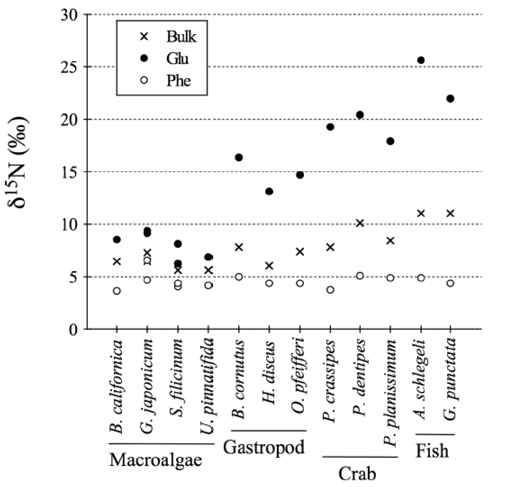

```{r setup chunk, setup, fig.dim=c(5,5), warning=FALSE, message=FALSE}
require("knitr")
knitr::opts_chunk$set(warning=FALSE, message=FALSE, fig.align='center')

###############
# Carbon and Nitrogen Isotopic Analysis of Individual Amino Acids in Montipora capitata
# Author: C. Wall
# Collaborators: Brian Popp, Ruth Gates
# Institution: University of Hawai'i at Mānoa
###############

# load packages
library(devtools)
#install_github("ggbiplot", "vqv")
library(ggbiplot)
require(graphics)
library(dplyr)
library(effects)
library(plyr)
library(plotrix)
library("cowplot")
```

### Background
Techniques for  Compound Specific Isotope Analysis (CSIA) of individual amino acids (AA) have been developed to better understand ecosystem food webs, trophic positions, and sources of nutrition in biological samples ranging from bacteria to ceteceans. Bulk tissue isotope analysis requires separate accounting for isotopic signatures at the base of the food web, which vary in across locations and time periods. However, CSIA can account for both source and trophic isotope effects in a single sample of a consumer's tissue.
  
*Source amino acids* are a group of AA that exhibit little change in isotopic composition with increasing trophic levels and reflect the isotopic composition of the 'source material' at the base of the food web from which they originated. 
  
*Trophic amino acids* on the other hand are a group of AA that show significant ^15^N enrichment compared to source-AA, which correspond to trophic steps.This enrichment is quite large and may exceed 8 ‰.  


<center>
{ width=70%} </center>


### Carbon and Nitrogen AA
Carbon in amino acids of plankton, Symbiodiniaceae symbionts and coral host tissues.
```{r Carbon, results='hide'}
######## ######## 
## Carbon 
######## ######## 
rm(list=ls())
d13C.dat<-read.csv("data/d13C.CSIA.wide.csv") # wide form carbon data

colnames(d13C.dat)
d13C.dat$Fraction<-factor(d13C.dat$Fraction, levels=c("host", "symb", "plank"))
d13C.dat<-d13C.dat[ , !(names(d13C.dat) %in% c("Norleucine", "Aminoadipic.Acid", "Methionine"))] #remove Norleucine, Methionine, Aminoadipic Acid


######## ######## 
## Nitrogen 
######## ######## 
d15N.dat<-read.csv("data/d15N.CSIA.wide.csv") # wide form carbon data
d15N.dat<-d15N.dat[ , !(names(d15N.dat) %in% c("Norleucine", "Aminoadipic.Acid", "Methionine"))]
d15N.dat$Fraction<-factor(d15N.dat$Fraction, levels=c("host", "symb", "plank"))
```
  

#### PCA 

**Carbon by treatment**  
  
```{r PCA carbon by treatment, results='hide', message=FALSE}
######## ######## ######## ######## 
######## ######## ######## ######## by treatment
# PCA dataframe
PCA.df<-d13C.dat[, c(7:8,11:23)]

PC<- prcomp(PCA.df[,c(-1:-2)], center = TRUE, scale= TRUE) 
PC.summary<-summary(PC)
ev<-PC$sdev^2 
newdat<-PC$x[,1:4] # 2 PCAs explain 76% of variance
#plot(PC, type="lines", main="PC.area eigenvalues")

## PC1 and PC2
PC.fig1 <- ggbiplot(PC, choices = 1:2, obs.scale = 1, var.scale = 1, 
                             groups= PCA.df[,1], ellipse = TRUE,
                             circle = FALSE) +
  scale_color_discrete(name = '') +
  theme_bw() +
  scale_x_continuous(breaks=pretty_breaks(n=5))+
  coord_cartesian(xlim = c(-8, 8), ylim=c(-4, 4))+ 
  theme(axis.ticks.length=unit(-0.25, "cm"), axis.text.y=element_text(margin=unit(c(0.5, 0.5, 0.5, 0.5), "cm")), axis.text.x=element_text(margin=unit(c(0.5, 0.5, 0.5, 0.5), "cm"))) +
  theme(legend.text=element_text(size=15)) +
  theme(panel.background = element_rect(colour = "black", size=1))+
  theme(legend.key = element_blank())+
  theme(legend.direction = 'horizontal', legend.position = 'top') +theme(aspect.ratio=0.8) +
  annotate("text", x=6, y=3.6,  size=5, label= expression(paste(delta^{13},C[AA])))
print(PC.fig1)
#ggsave("figures/carbon/PCA_d13C.trt.pdf", height=5, width=8, encod="MacRoman")
```
  
**Nitrogen by treatment**
```{r PCA nitrogen by treatment, results='hide', message=FALSE}
# PCA dataframe
PCA.df<-d15N.dat[, c(7:8,11:23)]
PC<- prcomp(PCA.df[, c(-1:-2)], center = TRUE, scale= TRUE) 
PC.summary<-summary(PC)
ev<-PC$sdev^2 
newdat<-PC$x[,1:4] # 2 PCAs explain 74% of variance
#plot(PC, type="lines", main="PC.area eigenvalues")

######################## treatments
## PC1 and PC2
PC.fig2 <- ggbiplot(PC, choices = 1:2, obs.scale = 1, var.scale = 1, 
                   groups= PCA.df[,1], ellipse = TRUE,
                   circle = FALSE) +
  scale_color_discrete(name = '') +
  theme_bw() +
  coord_cartesian(xlim = c(-8, 5), ylim=c(-6, 6)) +
  theme(axis.ticks.length=unit(-0.25, "cm"), axis.text.y=element_text(margin=unit(c(0.5, 0.5, 0.5, 0.5), "cm")), axis.text.x=element_text(margin=unit(c(0.5, 0.5, 0.5, 0.5), "cm"))) +
  theme(legend.text=element_text(size=15)) +
  theme(panel.background = element_rect(colour = "black", size=1))+
  theme(legend.key = element_blank())+
  theme(legend.direction = 'horizontal', legend.position = 'top') +theme(aspect.ratio=0.8) +
  annotate("text", x=4, y=5.5,  size=5, label= expression(paste(delta^{15},N[AA])))
print(PC.fig2)
#ggsave("figures/nitrogen/PCA_d15N.trt.pdf", height=5, width=6, encod="MacRoman")
```
  
**Carbon PCA by fraction (plankton, host, symbiont)** 
```{r PCA carbon by fraction, results='hide', message=FALSE}
######## ######## ######## ######## 
######## ######## ######## ######## by fraction

PC.fig3 <- ggbiplot(PC, choices = 1:2, obs.scale = 1, var.scale = 1, 
                   groups= PCA.df[,2], ellipse = TRUE,
                   circle = FALSE) +
  scale_color_discrete(name = '') +
  theme_bw() +
  coord_cartesian(xlim = c(-8, 8), ylim=c(-4, 4)) +
  theme(axis.ticks.length=unit(-0.25, "cm"), axis.text.y=element_text(margin=unit(c(0.5, 0.5, 0.5, 0.5), "cm")), axis.text.x=element_text(margin=unit(c(0.5, 0.5, 0.5, 0.5), "cm"))) +
  theme(legend.text=element_text(size=15)) +
  theme(panel.background = element_rect(colour = "black", size=1))+
  theme(legend.key = element_blank())+
  theme(legend.direction = 'horizontal', legend.position = 'top') +theme(aspect.ratio=0.8) +
  annotate("text", x=6, y=3.6,  size=5, label= expression(paste(delta^{13},C[AA])))
print(PC.fig3)
#ggsave("figures/carbon/PCA_d13C.frac.pdf", height=5, width=8, encod="MacRoman")
```

**Nitrogen PCA by fraction (plankton, host, symbiont)** 
```{r PCA nitrogen by fraction, results='hide', message=FALSE}
######################### fractions
## PC1 and PC2
PC.fig4 <- ggbiplot(PC, choices = 1:2, obs.scale = 1, var.scale = 1, 
                   groups= PCA.df[,2], ellipse = TRUE,
                   circle = FALSE) +
  scale_color_discrete(name = '') +
  theme_bw() +
  coord_cartesian(xlim = c(-8, 5), ylim=c(-6, 6)) + 
  theme(axis.ticks.length=unit(-0.25, "cm"), axis.text.y=element_text(margin=unit(c(0.5, 0.5, 0.5, 0.5), "cm")), axis.text.x=element_text(margin=unit(c(0.5, 0.5, 0.5, 0.5), "cm"))) +
  theme(legend.text=element_text(size=15)) +
  theme(panel.background = element_rect(colour = "black", size=1))+
  theme(legend.key = element_blank())+
  theme(legend.direction = 'horizontal', legend.position = 'top') +theme(aspect.ratio=0.8) +
  annotate("text", x=4, y=5.5,  size=5, label= expression(paste(delta^{15},N[AA])))
print(PC.fig4)
#ggsave("figures/nitrogen/PCA_d15N.frac.pdf", height=5, width=8, encod="MacRoman")
```
  
### Carbon AA
  
#### Models  
Run models looking for effects of Fraction or the Treatment-Interaction (feeding/light).
  
```{r models, fig.dim=c(6,3)}
d13C.dat2<-d13C.dat[!(d13C.dat$Fraction=="plank"),] #remove plankton for now

for(i in c(11:23)){
  Y=d13C.dat2[,i]
  mod<-aov(Y~Fraction+Treat.Int, data=d13C.dat2)
  print(anova(mod))
  plot(allEffects(mod), ylab=colnames(d13C.dat2)[i], cex.axis=0.5, cex.lab=0.5)
}
# Almost Fraction effect for Alanine, Proline
# Fraction effect for: Glycine, Glutamic acid
# Treatment effect for: Glycine
# Almost Treatment effect: Glutamic Acid
```
  
  
#### Figures  
-New dataframe (long format) here to make figures. Same data as above.
```{r, fig.dim=c(8,3)}
###########
###########
# CSAA.dat long

d13C.dat.long<-read.csv("data/d13C.CSIA.long.csv")
#str(d13C.dat.long)

d13C.dat.long<-d13C.dat.long[!(d13C.dat.long$Amino.acid=="Methionine"),]
d13C.dat.long<-d13C.dat.long[!(d13C.dat.long$Amino.acid=="Norleucine"),]
d13C.dat.long<-d13C.dat.long[!(d13C.dat.long$Amino.acid=="Aminoadipic Acid"),] # remove unwanted data

d13C.dat.long$AA.short<-mapvalues(d13C.dat.long$Amino.acid, from =c("Alanine", "Aspartic acid", "Glutamic acid", "Glycine", "Isoleucine", "Leucine", "Lysine", "Phenylalanine", "Proline", "Serine", "Threonine", "Tyrosine", "Valine"), to = c("Ala", "Asp", "Glu", "Gly", "Ile", "Leu", "Lys", "Phe", "Pro", "Ser", "Thr", "Tyr", "Val"))

d13C.dat.long$AA.short<-factor(d13C.dat.long$AA.short, levels=c("Ala","Asp", "Glu", "Ile", "Leu", "Pro", "Val", "Gly", "Lys", "Ser", "Phe", "Thr", "Tyr"))

# looking at average trophic and source AA
# trophic example = glutamate, source = phenylalanine
# Source AA  not enriched with trophic transfers
# Trophic AA change with trophic transfers... these are the ones below

d13C.dat.long$AA.cat<-ifelse(d13C.dat.long$AA.short=="Asp" | d13C.dat.long$AA.short=="Glu" | 
                               d13C.dat.long$AA.short=="Ala" | d13C.dat.long$AA.short=="Ile" | 
                               d13C.dat.long$AA.short=="Leu" | d13C.dat.long$AA.short=="Val" | 
                               d13C.dat.long$AA.short=="Pro", "Troph", "Source")

mod<-lm(d13C.value~AA.short+Treat.Int*Fraction, data=d13C.dat.long)
print(anova(mod))
#plot(allEffects(mod), par.strip.text=list(cex=0.7), par.settings=list(axis.text=list(cex=0.7)))

dfC<-d13C.dat.long
dfC<-dfC[!(dfC$AA.short == "Thr"), ] # removing Thr because not source or trophic
```
  
#### Table: Carbon Essential and Nonessential AA

```{r EAA and NEAA, results='hide'}
##################
# all trophic and source AA
AA.means<-aggregate(d13C.value~AA.cat+Treat.Int+Fraction, data=dfC, mean, na.rm=TRUE); AA.means
AA.sd<-aggregate(d13C.value~AA.cat+Treat.Int+Fraction, data=dfC, sd, na.rm=TRUE)
colnames(AA.sd)[4]="SD"
AA.means<-cbind(AA.means, AA.sd[4])
AA.means$Fraction<-factor(AA.means$Fraction, levels=c("host", "symb", "plank"))

```
   
- d13C by fraction and treatments, showing d13C.CSIA_frac.trt
```{r, results='hide'}
#################
#################
# d13C by fraction and treatments

df.mean<-aggregate(d13C.value~AA.short+Fraction+Treat.Int, data=dfC, mean, na.rm=TRUE)
df.n<-aggregate(d13C.value~AA.short+Fraction+Treat.Int, data=dfC, length)
df.SD<-aggregate(d13C.value~AA.short+Fraction+Treat.Int, data=dfC, sd, na.rm=TRUE)
colnames(df.SD)[4]="SD"
df.mean<-cbind(df.mean, df.SD[4])
df.mean$Fraction<-factor(df.mean$Fraction, levels=c("host", "symb", "plank"))


######## Figures
Fig.formatting<-(theme_classic()) +
  theme(text=element_text(size=10),
        axis.line=element_blank(),
        legend.text.align = 0,
        legend.text=element_text(size=10),
        #legend.title = element_blank(),
        panel.border = element_rect(fill=NA, colour = "black", size=1),
        aspect.ratio=1, 
        axis.ticks.length=unit(0.25, "cm"),
        axis.text.y=element_text(
          margin=unit(c(0.5, 0.5, 0.5, 0.5), "cm"), colour="black", size=10), 
        axis.text.x=element_text(
          margin=unit(c(0.5, 0.5, 0.5, 0.5), "cm"), colour="black", size=8)) +
  theme(legend.key.size = unit(0.4, "cm")) +
  theme(aspect.ratio=1) +
  theme(panel.spacing=unit(c(0, 0, 0, 0), "cm"))

#######

pd <- position_dodge(0.5) #offset for error bars

d13C.CSIA_frac.trt<-ggplot(df.mean, aes(x=AA.short, y=d13C.value)) +
  geom_point(size=2, position=pd, aes(shape=Treat.Int, color=Fraction, group=Treat.Int)) +
  geom_errorbar(aes(ymin=d13C.value-SD, ymax=d13C.value+SD, color=Fraction, group=Treat.Int), 
                size=.5, width=0, position=pd) +
  ggtitle(expression(paste(delta^{13}, C[AA], " by biological fraction and treatment"))) +
  geom_vline(xintercept=7.5, linetype="solid", color = "gray") +
  annotate(geom="text", label="Essential-AA", x=4, y=0, color="gray40") +
  annotate(geom="text", label="Nonessential-AA", x=10, y=0, color="gray40") +
  coord_cartesian(ylim=c(-35, 0)) + 
  xlab("Amino Acids") +
  scale_color_manual(values=c("coral", "springgreen3", "skyblue3")) +
  ylab(expression(paste(delta^{13}, C[AA], " (\u2030, V-PDB)"))) +
  Fig.formatting
print(d13C.CSIA_frac.trt)
#ggsave("figures/carbon/d13C.CSIA_frac.trt.pdf", height=5, width=8, encod="MacRoman")
```

  
- all d13C amino acids: showing d13C.CSIA_Trt.alone -- move to **Supplement**
```{r, results='hide'}
##################
# all d13C amino acids

df.mean2<-aggregate(d13C.value~AA.short+Treat.Int, data=dfC, mean, na.rm=TRUE)
df.SD2<-aggregate(d13C.value~AA.short+Treat.Int, data=dfC, na.rm=TRUE, sd)
df.SD2[is.na(df.SD2)] <- 0
colnames(df.SD2)[3]="SD"
df.mean2<-cbind(df.mean2, df.SD2[3])

pd <- position_dodge(0.5) #offset for error bars

 d13C.CSIA_Trt.alone<-ggplot(df.mean2, aes(x=AA.short, y=d13C.value, group=Treat.Int)) +
  geom_errorbar(aes(ymin=d13C.value-SD, ymax=d13C.value+SD, color=Treat.Int), size=.5, width=0, position=pd) +
  geom_point(aes(color=Treat.Int), size=2, position=pd) +
  ggtitle(expression(paste(delta^{13}, C[AA], " by treatment"))) +
  geom_vline(xintercept=7.5, linetype="solid", color = "gray") +
  annotate(geom="text", label="Essential-AA", x=4, y=0, color="gray40") +
  annotate(geom="text", label="Nonessential-AA", x=10, y=0, color="gray40") +
  coord_cartesian(ylim=c(-35, 0)) + 
  xlab("Amino Acids") +
  scale_color_manual(values=c("gray40", "darkgoldenrod1", "coral", "skyblue2")) +
  ylab(expression(paste(delta^{13}, C[AA], " (\u2030, V-PDB)"))) +
  Fig.formatting
print(d13C.CSIA_Trt.alone)
#ggsave("figures/carbon/d13C.CSIA_Trt.alone.pdf", height=5, width=8, encod="MacRoman")
```
  
   
- d13C by fraction, showing d13C.CSIA_frac -- move to **Supplement**
```{r}
# all AA pooled by fraction
pd <- position_dodge(0.5) #offset for error bars

d13C.CSIA_Fraction<- ggplot(df.mean, aes(x=AA.short, y=d13C.value)) +
  geom_errorbar(aes(ymin=d13C.value-SD, ymax=d13C.value+SD, color=Fraction), 
                size=.5, width=0, position=pd) +
  geom_point(size=2, pch=19,  position=pd, aes(color=Fraction)) +
  geom_vline(xintercept=7.5, linetype="solid", color = "gray") +
  annotate(geom="text", label="Trophic-AA", x=4.0, y=0, color="gray40") +
  annotate(geom="text", label="Source-AA", x=10.0, y=0, color="gray40") +
  ggtitle(expression(paste(delta^{13}, C[AA], " by biological fraction"))) +
  coord_cartesian(ylim=c(-35, 0)) + 
  xlab("Amino Acids") + 
  ylab(expression(paste(delta^{13}, C[AA], " (\u2030, V-PDB)"))) +
  scale_color_manual(values=c("coral", "springgreen3", "skyblue3")) +
  Fig.formatting
print(d13C.CSIA_Fraction)
#ggsave("figures/carbon/d13C.CSIA_Fraction.pdf", height=5, width=8, encod="MacRoman")
```

  

### Nitrogen AA 
  
#### Models  
  
Overall we see:  
- Fraction effect for: Leucine, Proline, Aspartic Acid, Glutamic Acid, Tyrosine.  
- Treatment effect for: Leucine  

```{r, fig.dim=c(6,3)}
d15N.dat2<-d15N.dat[!(d15N.dat$Fraction=="plank"),] #remove plankton for now

for(i in c(11:23)){
  Y=d15N.dat2[,i]
  mod<-aov(Y~Fraction+Treat.Int, data=d15N.dat2)
  print(anova(mod), cex=0.5)
  plot(allEffects(mod), ylab=colnames(d15N.dat2)[i], cex.axis=0.5)
}
# Fraction effect for: Leucine, Proline, Aspartic Acid, Glutamic Acid, Tyrosine
# Treatment effect for: Leucine
```
  
#### Figures
```{r, fig.dim=c(8,3)}
###########
###########
# d15N.CSIA.dat long
d15N.dat.long<-read.csv("data/d15N.CSIA.long.csv")

#str(d15N.dat.long)

d15N.dat.long<-d15N.dat.long[!(d15N.dat.long$Amino.acid=="Methionine"),]
d15N.dat.long<-d15N.dat.long[!(d15N.dat.long$Amino.acid=="Norleucine"),]
d15N.dat.long<-d15N.dat.long[!(d15N.dat.long$Amino.acid=="Aminoadipic Acid"),] # remove unwanted data

d15N.dat.long$AA.short<-mapvalues(d15N.dat.long$Amino.acid, from =c("Alanine", "Aspartic acid", "Glutamic acid", "Glycine", "Isoleucine", "Leucine", "Lysine", "Phenylalanine", "Proline", "Serine", "Threonine", "Tyrosine", "Valine"), to = c("Ala", "Asp", "Glu", "Gly", "Ile", "Leu", "Lys", "Phe", "Pro", "Ser", "Thr", "Tyr", "Val"))

d15N.dat.long$AA.short<-factor(d15N.dat.long$AA.short, levels=c("Ala","Asp", "Glu", "Ile", "Leu", "Pro", "Val", "Gly", "Lys", "Ser", "Phe", "Thr", "Tyr"))

# looking at average Trophic and Source
d15N.dat.long$AA.cat<-ifelse(d15N.dat.long$AA.short=="Asp" | d15N.dat.long$AA.short=="Glu" | 
                               d15N.dat.long$AA.short=="Ala" | d15N.dat.long$AA.short=="Ile" | 
                               d15N.dat.long$AA.short=="Leu" | d15N.dat.long$AA.short=="Val" | 
                               d15N.dat.long$AA.short=="Pro", "Troph", "Source")

dfN<-d15N.dat.long
mod<-lm(d15N.value~AA.short+Treat.Int*Fraction, data=d15N.dat.long)
#plot(allEffects(mod), par.strip.text=list(cex=0.7), par.settings=list(axis.text=list(cex=0.7)))

#dfN<-d15N.dat.long[!(d15N.dat.long$AA.short=="Thr"), ] # not good source, remove here
```

  
- all AA pooled by fraction, showing d15N.CSIA_Fraction
```{r, results='hide'}
######## Figures
pd <- position_dodge(0.5) #offset for error bars

df.mean<-aggregate(d15N.value~AA.short+Fraction, data=dfN, mean, na.rm=TRUE)
df.n<-aggregate(d15N.value~AA.short+Fraction, data=dfN, length)
df.SD<-aggregate(d15N.value~AA.short+Fraction, data=dfN, sd, na.rm=TRUE)
df.SD[is.na(df.SD)] <- 0
colnames(df.SD)[3]="SD"
df.mean<-cbind(df.mean, df.SD[3])
df.mean$Fraction<-factor(df.mean$Fraction, levels=c("host", "symb", "plank"))

Fig.formatting<-(theme_classic()) +
  theme(text=element_text(size=10),
        axis.line=element_blank(),
        legend.text.align = 0,
        legend.text=element_text(size=10),
        #legend.title = element_blank(),
        panel.border = element_rect(fill=NA, colour = "black", size=1),
        aspect.ratio=1, 
        axis.ticks.length=unit(0.25, "cm"),
        axis.text.y=element_text(
          margin=unit(c(0.5, 0.5, 0.5, 0.5), "cm"), colour="black", size=10), 
        axis.text.x=element_text(
          margin=unit(c(0.5, 0.5, 0.5, 0.5), "cm"), colour="black", size=8)) +
  theme(legend.key.size = unit(0.4, "cm")) +
  theme(aspect.ratio=1) +
  theme(panel.spacing=unit(c(0, 0, 0, 0), "cm"))

######
# all AA pooled by fraction
d15N.CSIA_Fraction<-ggplot(df.mean, aes(x=AA.short, y=d15N.value)) +
  geom_errorbar(aes(ymin=d15N.value-SD, ymax=d15N.value+SD, color=Fraction), 
                size=.5, width=0, position=pd) +
  geom_point(size=2, pch=19,  position=pd, aes(color=Fraction)) +
  ggtitle(expression(paste(delta^{15}, N[AA], " by biological fraction"))) +
  coord_cartesian(ylim=c(15, -5)) +
  geom_vline(xintercept=7.5, linetype="solid", color = "gray") +
  annotate(geom="text", label="Trophic-AA", x=4, y=15, color="gray40") +
  annotate(geom="text", label="Source-AA", x=10, y=15, color="gray40") +
  xlab("Amino Acids") + 
  ylab(expression(paste(delta^{15}, N[AA], " (\u2030, Air)"))) +
  scale_color_manual(values=c("coral", "springgreen3", "skyblue3")) +
  Fig.formatting
print(d15N.CSIA_Fraction)
#ggsave("figures/nitrogen/d15N.CSIA_Fraction.pdf", height=5, width=8, encod="MacRoman")
```
  
- Fraction and treatment, showing d15N.CSIA_frac.trt
```{r, results='hide'}
#################
df.mean<-aggregate(d15N.value~AA.short+Fraction+Treat.Int, data=dfN, mean, na.rm=TRUE)
df.n<-aggregate(d15N.value~AA.short+Fraction+Treat.Int, data=dfN, length)
df.SD<-aggregate(d15N.value~AA.short+Fraction+Treat.Int, data=dfN, sd, na.rm=TRUE)
colnames(df.SD)[4]="SD"
df.mean<-cbind(df.mean, df.SD[4])
df.mean$Fraction<-factor(df.mean$Fraction, levels=c("host", "symb", "plank"))

d15N.CSIA_frac.trt<-ggplot(df.mean, aes(x=AA.short, y=d15N.value)) +
  geom_point(size=2, aes(shape=Treat.Int, color=Fraction, group=Treat.Int), position=pd) +
  geom_errorbar(aes(ymin=d15N.value-SD, ymax=d15N.value+SD, group=Treat.Int, color=Fraction), 
                size=.5, width=0, position=pd) +
  ggtitle(expression(paste(delta^{15}, N[AA], " by biological fraction, treatment"))) +
  coord_cartesian(ylim=c(15, -5)) + 
  geom_vline(xintercept=7.5, linetype="solid", color = "gray") +
  annotate(geom="text", label="Trophic-AA", x=4, y=15, color="gray40") +
  annotate(geom="text", label="Source-AA", x=10, y=15, color="gray40") +
  xlab("Amino Acids") +
  scale_color_manual(values=c("coral", "springgreen3", "skyblue3")) +
  ylab(expression(paste(delta^{15}, N[AA], " (\u2030, Air)"))) +
  Fig.formatting
print(d15N.CSIA_frac.trt)
#ggsave("figures/nitrogen/d15N.CSIA_frac.trt.pdf", height=5, width=8, encod="MacRoman")
```
  
- all amino acids, showing d15N.CSIA_Trt.alone.pdf
```{r, results='hide'}
##################
# all d15N amino acids

df.mean2<-aggregate(d15N.value~AA.short+Treat.Int, data=dfN, mean, na.rm=TRUE)
df.SD2<-aggregate(d15N.value~AA.short+Treat.Int, data=dfN, na.rm=TRUE, sd)
df.SD2[is.na(df.SD2)] <- 0
colnames(df.SD2)[3]="SD"
df.mean2<-cbind(df.mean2, df.SD2[3])

d15N.CSIA_Trt.alone<-ggplot(df.mean2, aes(x=AA.short, y=d15N.value, group=Treat.Int)) +
  geom_errorbar(aes(ymin=d15N.value-SD, ymax=d15N.value+SD, color=Treat.Int), size=.5, width=0, position=pd) +
  geom_point(aes(color=Treat.Int), size=2, position=pd) +
  ggtitle(expression(paste(delta^{15}, N[AA], " by treatment"))) +
  coord_cartesian(ylim=c(15, -5)) + 
  geom_vline(xintercept=7.5, linetype="solid", color = "gray") +
  annotate(geom="text", label="Trophic-AA", x=4, y=15, color="gray40") +
  annotate(geom="text", label="Source-AA", x=10, y=15, color="gray40") +
  xlab("Amino Acids") +
  scale_color_manual(values=c("gray40", "darkgoldenrod1", "coral", "skyblue2")) +
  ylab(expression(paste(delta^{15}, N[AA], " (\u2030, Air)"))) +
  Fig.formatting
print(d15N.CSIA_Trt.alone)
#ggsave("figures/nitrogen/d15N.CSIA_Trt.alone.pdf", height=5, width=8, encod="MacRoman")
```
  
- all source and trophic AA, showing d15N.CSIA_TrSo **supplement**
```{r, results='hide'}
##################
# all source and trophic) AA
AA.means<-aggregate(d15N.value~AA.cat+Treat.Int+Fraction, data=dfN, mean, na.rm=TRUE)
AA.sd<-aggregate(d15N.value~AA.cat+Treat.Int+Fraction, data=dfN, sd, na.rm=TRUE)
colnames(AA.sd)[4]="SD"
AA.means<-cbind(AA.means, AA.sd[4])
AA.means$Fraction<-factor(AA.means$Fraction, levels=c("host", "symb", "plank"))

ggplot(AA.means, aes(x=Treat.Int, y=d15N.value, shape=AA.cat, color=Fraction)) +
  geom_errorbar(aes(ymin=d15N.value-SD, ymax=d15N.value+SD, shape=AA.cat, color=Fraction), size=.5, width=0, position=pd) +
  geom_point(aes(shape=AA.cat, color=Fraction), size=3, position=pd) +
  ggtitle(expression(paste(delta^{15}, N[AA], " by biological fraction, Tr/So-AA"))) +
  coord_cartesian(ylim=c(12, 0)) + 
  scale_x_discrete(name ="Treatments", 
                   labels=c("Dark\nFed", "Light\nFed", "Light\nNot Fed")) +
  scale_color_manual(values=c("coral", "springgreen3",  "skyblue3")) +
  ylab(expression(paste(delta^{15}, N[AA], " (\u2030, Air)"))) +
  Fig.formatting
#ggsave("figures/nitrogen/d15N.CSIA_TrSo.pdf", height=5, width=8, encod="MacRoman")
```

  
##### Trophic position and proxy  
Trophic position using trophic AA gultamic acid (Glu) and source amino acid phenylalanine (Phe), following [Chikaraishi et al. 2009](https://aslopubs.onlinelibrary.wiley.com/doi/10.4319/lom.2009.7.740)
  
$Trophic~position~(TP){_C}{_S}{_I}{_A}= [(δ{^1}{^5}N{_T}{_r}{_p}~-~δ{^1}{^5}N{_S}{_r}{_c})-B/~TDF{_A}{_A} +1$  
  
- Trophic Position, showing TP.glu.phe
```{r, results='hide'}
###
# scatter of glutamic.acid vs. phenylalanine
 
       
### ### ### 
### ### ### trophic position using trophic (Glu) and source (Phe) AA, Chikaraishi et al. 2009

d15N.dat # dataframe here
# glu = trophic AA (changing with food,  show enrichment realtive to source
# phe = source AA (showlittle change with increasing trophic position, reflect d15N baseline)
# beta = 3.4 (difference in d15N values among trophic and source AAs in primary producers, @ TP=1)
# TDFAA = trophic discrimination factor: mean 15N enrichment of >=1 trophic vs. source AA per trophic level
 
d15N.dat<-d15N.dat %>% mutate(TP = ((Glutamic.acid - Phenylalanine - 3.4)/7.6) +1)

df.mean<-aggregate(TP~Treat.Int+Fraction, data=d15N.dat, mean, na.rm=TRUE)
df.SD<-aggregate(TP~Treat.Int+Fraction, data=d15N.dat, sd, na.rm=TRUE)
colnames(df.SD)[3]="SD"
df.mean<-cbind(df.mean, df.SD[3])
df.mean$Fraction<-factor(df.mean$Fraction, levels=c("host", "symb", "plank"))

TP<-ggplot(df.mean, aes(x=Treat.Int, y=TP)) +
  geom_errorbar(aes(ymin=TP-SD, ymax=TP+SD, color=Fraction), 
                size=.5, width=0, position=pd) +
  geom_point(size=2, pch=19,  position=pd, aes(color=Fraction)) +
  ggtitle("Chikaraishi trophic position") +
  coord_cartesian(ylim=c(3, 0)) +
  scale_x_discrete(name ="Treatments", 
                   labels=c("Dark\nFed", "Light\nFed", "Light\nNot Fed", "Plankton")) +
  ylab(expression(paste("TP "~delta^{15}, N[Glu-Phe], " (\u2030, Air)"))) +
  scale_color_manual(values=c("coral", "springgreen3", "skyblue3")) +
  Fig.formatting
print(TP)
#ggsave("figures/nitrogen/TP.glu.phe.pdf", height=5, width=8, encod="MacRoman")
```
  
  
##### Sum V
Calculate Sum-V, [McCarthy et al. 2007](https://www.sciencedirect.com/science/article/pii/S0016703707004255). The sum-V parameter is a proxy for total heterotrophic resynthesis. It is defined as the average deviation in the d15N values of the trophic amino acids Ala, Asp, Glu, Ile, Leu, and Pro.  

- showing d15N.sumV.CSIA **move to supplement**
```{r, results='hide', warning=FALSE}
###########
###########
# d15N.CSIA.dat long
d15N.dat.long<-read.csv("data/d15N.CSIA.long.csv")

#str(d15N.dat.long)

d15N.dat.long<-d15N.dat.long[!(d15N.dat.long$Amino.acid=="Methionine"),]
d15N.dat.long<-d15N.dat.long[!(d15N.dat.long$Amino.acid=="Norleucine"),]
d15N.dat.long<-d15N.dat.long[!(d15N.dat.long$Amino.acid=="Aminoadipic Acid"),] # remove unwanted data

d15N.dat.long$AA.short<-mapvalues(d15N.dat.long$Amino.acid, from =c("Alanine", "Aspartic acid", "Glutamic acid", "Glycine", "Isoleucine", "Leucine", "Lysine", "Phenylalanine", "Proline", "Serine", "Threonine", "Tyrosine", "Valine"), to = c("Ala", "Asp", "Glu", "Gly", "Ile", "Leu", "Lys", "Phe", "Pro", "Ser", "Thr", "Tyr", "Val"))

d15N.dat.long$AA.short<-factor(d15N.dat.long$AA.short, levels=c("Ala","Asp", "Glu", "Ile", "Leu", "Pro", "Val", "Gly", "Lys", "Ser", "Phe", "Thr", "Tyr"))

# looking at average Trophic and Source
d15N.dat.long$AA.cat<-ifelse(d15N.dat.long$AA.short=="Asp" | d15N.dat.long$AA.short=="Glu" | 
                               d15N.dat.long$AA.short=="Ala" | d15N.dat.long$AA.short=="Ile" | 
                               d15N.dat.long$AA.short=="Leu" | d15N.dat.long$AA.short=="Val" | 
                               d15N.dat.long$AA.short=="Pro", "Troph", "Source")

dfN<-d15N.dat.long
mod<-lm(d15N.value~AA.short+Treat.Int*Fraction, data=d15N.dat.long)
#plot(allEffects(mod), par.strip.text=list(cex=0.7), par.settings=list(axis.text=list(cex=0.7)))

#dfN<-d15N.dat.long[!(d15N.dat.long$AA.short=="Thr"), ] # not good source, remove here


###########################
###########################
###########################
# dfN is dataframe
sV.df<-d15N.dat.long

# make dataframe for AA, that with su deviance = sum-V
sV.df<-sV.df[c(sV.df$AA.short=="Ala" | sV.df$AA.short=="Glu" | sV.df$AA.short=="Asp" | 
                  sV.df$AA.short=="Ile" | sV.df$AA.short=="Leu" | sV.df$AA.short=="Pro"),]

#write.csv(sV.df, "sumV.csv")

sumVdf<-read.csv("data/sumV.csv")
sumVdf$Fraction<-factor(sumVdf$Fraction, levels=c("host", "symb", "plank"))

sumVdf.mean<-aggregate(sumV~AA.short+AA.cat+Fraction+Treat.Int, data=sumVdf, mean, na.rm=TRUE)
sumVdf.sd<-aggregate(sumV~AA.short+AA.cat+Fraction+Treat.Int, data=sumVdf, sd, na.rm=TRUE)
sumVdf<-cbind(sumVdf.mean, sumVdf.sd[5])
colnames(sumVdf)[5]<-"mean.sumV"
colnames(sumVdf)[6]="SD"
sumVdf[is.na(sumVdf)] <- 0

pd <- position_dodge(0.7) #offset for error bars and columns

sumV<-ggplot(sumVdf, aes(x=Treat.Int, y=mean.sumV)) +
  geom_point(aes(color=Fraction), size=2, position=pd) +
  geom_errorbar(aes(ymin=mean.sumV-SD, ymax=mean.sumV+SD, color=Fraction), 
                size=.5, width=0, position=pd) +
  coord_cartesian(ylim=c(0, 3))+ 
  ggtitle(expression(paste("Sum-V ", delta^{15}, N[AA]))) +
  scale_color_manual(values=c("coral", "springgreen3", "skyblue3")) +
  scale_x_discrete(name ="Treatments", 
                   labels=c("Dark\nFed", "Light\nFed", "Light\nNot Fed", "Plankton")) +
  ylab(expression(paste(delta^{15}, N[Sum-V], " (\u2030, Air)"))) +
  Fig.formatting
print(sumV)
#ggsave("figures/nitrogen/d15N.sumV.CSIA.pdf", height=5, width=8, encod="MacRoman")
```

  
##### Weighted means 
These are the weighted means for trophic and source AA following [Bradley et al. 2015](https://aslopubs.onlinelibrary.wiley.com/doi/abs/10.1002/lom3.10041). Weighted mean AA δ^15^N values.  
  
- weighted means, showing wt.mean.d15N.CSIA **supplement**
```{r, results='hide', warning=FALSE}
###########################
##################
#########

df.mean<-aggregate(d15N.value~AA.short+AA.cat+Fraction+Treat.Int, data=dfN, mean, na.rm=TRUE)
df.SD<-aggregate(d15N.value~AA.short+AA.cat+Fraction+Treat.Int, data=dfN, sd, na.rm=TRUE)
colnames(df.SD)[5]="SD"
df.mean<-cbind(df.mean, df.SD[5])
df.mean$mean.sd<-(df.mean$d15N.value/df.mean$SD)
df.mean$inv.sd<-(1/df.mean$SD)
# write.csv(df.mean, "wtmeans.csv") # use this to calculate weighted mean
# weighted mean is sum(mean.sd/inv.sd) for trophic AA, same for source AA
# delta.Tr.So (below) is difference in (weighted mean) Trophic AA - Source AA for host or symb, per treatment

#########
wt.mean<-read.csv("data/wt.means.d15N.csv")
wt.mean.df<-aggregate(wt.mean~AA.cat+Fraction+Treat.Int, data=wt.mean, mean, na.rm=TRUE)
SD<-aggregate(wt.SD~AA.cat+Fraction+Treat.Int, data=wt.mean, mean, na.rm=TRUE); colnames(SD)[4]<-"wt.SD"
wt.mean.df<-cbind(wt.mean.df, SD[4])


pd <- position_dodge(0.5) #offset for error bars
ggplot(wt.mean.df, aes(x=Treat.Int, y=wt.mean)) +
  geom_point(aes(color=Fraction, shape=AA.cat), size=3, position=pd) +
  geom_errorbar(aes(ymin=wt.mean-wt.SD, ymax=wt.mean+wt.SD, color=Fraction, shape=AA.cat), 
                size=.5, width=0, position=pd) +
  coord_cartesian(ylim=c(12, 0))+ 
  ggtitle(expression(paste("Weighted Mean ", delta^{15}, N[AA]))) +
  scale_color_manual(values=c("coral", "springgreen3")) +
  scale_x_discrete(name ="Treatments", 
                   labels=c("Dark\nFed", "Light\nFed", "Light\nNot Fed")) +
  ylab(expression(paste(delta^{15}, N[AA], " (\u2030, Air)"))) +
  Fig.formatting
ggsave("figures/wt.mean.d15N.CSIA.pdf", height=5, width=8, encod="MacRoman")
```
  
  
#### COMBINED FIGURES

**Figure 1-- PCA.combined**
```{r, fig.dim=c(8,8), results='hide'}
#### compile the 4 PCA ###
library("cowplot")
plot_grid(PC.fig1, PC.fig2, PC.fig3, PC.fig4, ncol = 2)
ggsave("figures/Fig 1.PCAs.pdf", height=8, width=11, encod="MacRoman")
######
```
  
**Figure 2-- AA.frac.trt combined**
```{r, AA.frac.trt, results='hide', fig.dim=c(9,5)}
leg1 <- get_legend(
  # create some space to the left of the legend
  d13C.CSIA_frac.trt + theme(legend.box.margin = margin(0, 0, 0, 12)))

AA.frac.trt<- plot_grid(d13C.CSIA_frac.trt + ggtitle("")+ 
                            theme(legend.position = "none",
                                  axis.text.x=element_text(size=7),  
                                  axis.text.y=element_text(size=7), 
                                  axis.title.x=element_text(size=7),
                                  axis.title.y=element_text(size=7)) +
                            annotate(geom="text", size=3, label="(a)", x=1, y=0, color="black"), 
                       d15N.CSIA_frac.trt + ggtitle("") + 
                            theme(legend.position = "none",
                                  axis.text.x=element_text(size=7),  
                                  axis.text.y=element_text(size=7), 
                                  axis.title.x=element_text(size=7),
                                  axis.title.y=element_text(size=7)) +
                       annotate(geom="text", size=3, label="(b)", x=1, y=15, color="black"),
                       ncol=2,nrow=1)
plot_grid(AA.frac.trt, leg1, rel_widths = c(8, 1)) # legend  1/8 size as first obj.
dev.copy(pdf, "figures/Fig 2.AA.frac.trt.pdf", width = 10, height = 5, encod="MacRoman")
```  
 
 
**Supplemental figure-- AA.trt combined**
```{r, AA.trt, results='hide', fig.dim=c(9,5)}
leg2 <- get_legend(
  # create some space to the left of the legend
d13C.CSIA_Trt.alone + theme(legend.box.margin = margin(0, 0, 0, 12)))

AA.trt<- plot_grid(d13C.CSIA_Trt.alone + ggtitle("")+ 
                            theme(legend.position = "none",
                                  axis.text.x=element_text(size=7),  
                                  axis.text.y=element_text(size=7), 
                                  axis.title.x=element_text(size=7),
                                  axis.title.y=element_text(size=7)) +
                            annotate(geom="text", size=3, label="(a)", x=1, y=0, color="black"), 
                       d15N.CSIA_Trt.alone + ggtitle("") + 
                            theme(legend.position = "none",
                                  axis.text.x=element_text(size=7),  
                                  axis.text.y=element_text(size=7), 
                                  axis.title.x=element_text(size=7),
                                  axis.title.y=element_text(size=7)) +
                       annotate(geom="text", size=3, label="(b)", x=1, y=15, color="black"),
                       ncol=2,nrow=1)
plot_grid(AA.trt, leg2, rel_widths = c(8, 1)) # legend  1/8 size as first obj.
dev.copy(pdf, "figures/Fig S1.AA.trt.pdf", width = 10, height = 5, encod="MacRoman")
```  
  
**Supplemental figure-- AA.frac combined**
```{r, AA.frac, results='hide', fig.dim=c(9,5)}
leg3 <- get_legend(
  # create some space to the left of the legend
d13C.CSIA_Fraction + theme(legend.box.margin = margin(0, 0, 0, 12)))

AA.trt<- plot_grid(d13C.CSIA_Fraction + ggtitle("")+ 
                            theme(legend.position = "none",
                                  axis.text.x=element_text(size=7),  
                                  axis.text.y=element_text(size=7), 
                                  axis.title.x=element_text(size=7),
                                  axis.title.y=element_text(size=7)) +
                            annotate(geom="text", size=3, label="(a)", x=1, y=0, color="black"), 
                       d15N.CSIA_Fraction + ggtitle("") + 
                            theme(legend.position = "none",
                                  axis.text.x=element_text(size=7),  
                                  axis.text.y=element_text(size=7), 
                                  axis.title.x=element_text(size=7),
                                  axis.title.y=element_text(size=7)) +
                       annotate(geom="text", size=3, label="(b)", x=1, y=15, color="black"),
                       ncol=2,nrow=1)
plot_grid(AA.trt, leg3, rel_widths = c(8, 1)) # legend  1/8 size as first obj.
dev.copy(pdf, "figures/Fig S2.AA.frac.pdf", width = 10, height = 5, encod="MacRoman")
```  
  
  
  
**Supplemental figure-- TP and Sum V combined**
```{r, TP and Sum V, results='hide', fig.dim=c(7,5)}
leg4 <- get_legend(
  # create some space to the left of the legend
  TP + theme(legend.box.margin = margin(0, 0, 0, 12)))

TP.sumV.plots<- plot_grid(TP + ggtitle("")+ 
                            theme(legend.position = "none",
                                  axis.text.x=element_text(size=7),  
                                  axis.text.y=element_text(size=7), 
                                  axis.title.x=element_text(size=7),
                                  axis.title.y=element_text(size=7)) +
                            annotate(geom="text", size=2.2, label="(a)", x=0.7, y=3, color="black"), 
                       sumV + ggtitle("") + 
                            theme(legend.position = "none",
                                  axis.text.x=element_text(size=7),  
                                  axis.text.y=element_text(size=7), 
                                  axis.title.x=element_text(size=7),
                                  axis.title.y=element_text(size=7)) +
                       annotate(geom="text", size=2.2, label="(b)", x=0.7, y=3, color="black"),
                       ncol=2,nrow=1)
plot_grid(TP.sumV.plots, leg4, rel_widths = c(6, 1)) # legend  1/3 size as first obj.
dev.copy(pdf, "figures/Fig S3.TP.sumV.pdf", width = 7, height = 5, encod="MacRoman")
```  
  

