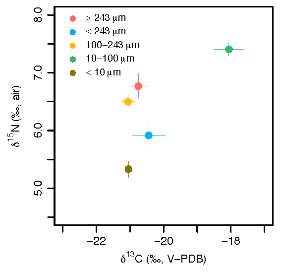

```{r setup chunk, setup, fig.dim=c(5,5), warning=FALSE, message=FALSE}

if (!require('knitr')) install.packages('knitr'); library('knitr')
knitr::opts_chunk$set(warning=FALSE, message=FALSE, fig.align='center')

###############
# Carbon and Nitrogen Isotopic Analysis of Individual Amino Acids in Montipora capitata
# Author: C. Wall
# Collaborators: Brian Popp, Ruth Gates, Natalie Wallsgrove
# Institution: University of Hawai'i at Mānoa
###############

# Load in packages
if (!require("pacman")) install.packages("pacman"); library(pacman) # for rapid install if not in library

pacman::p_load(devtools, ellipse, ggbiplot, vqv, patchwork, graphics, plyr, effects, MASS, tidyverse, dplyr, plotrix, vegan, cowplot, caret, reshape, car, emmeans, lmerTest)
```

### Background
Compound specific isotope analysis (CSIA) of individual amino acids (AA) have been developed to better understand ecosystem food webs, trophic positions, and sources of nutrition in biological samples ranging from bacteria to cetaceans. Bulk tissue isotope analysis requires separate accounting for isotopic signatures at the base of the food web, which vary in across locations and time periods. However, CSIA can account for both source and trophic isotope effects in a single sample of a consumer's tissue. In reef coral, advances in AA-CSIA/isotope analysis and so called "isotope fingerprinting" may help advance the study of coral trophic plasticity.  
  
Here, we exposed a reef coral (*Montipora capitata*) in symbiosis with Symbiodiniaceae algae to experimental treatments (autotrophy, mixotrophy, heterotrophy) to test for trophic shifts and amino acid (AA) sources using paired bulk (δ^13^C, δ^15^N) and AA-CSIA (δ^13^CAA, δ^15^NAA).
  
**AA grouping**  
*Esstential amino acids* (EAA) refer to AA-carbon, these are a group of amino acids that organisms require through their diet and show limited change across trophic levels.  
 
*Non-essential amino acids* (NEAA) refer to AA-carbon, there amino acids are synthesized from carbon pools or direct routing of nonessential amino acids sourced from dietary protein.  
  
*Source amino acids* refer to AA-nitrogen, with a group of AA that exhibit little change in isotopic composition with increasing trophic levels and reflect the isotopic composition of the 'source material' at the base of the food web from which they originated. 
  
*Trophic amino acids* refer to AA-nitrogen, and are a group of AA that show significant ^15^N enrichment compared to source-AA, which correspond to trophic steps.This enrichment is quite large and may exceed 8 ‰.  

  
### Bulk isotopes  
Bulk sample isotope data from plankton in Kāne'ohe Bay (previously published, Wall et al. 2020, *ISME J*)
```{r, plankton bulk isotopes}
SWiso<-read.csv("data/other/Wall_bulk_isotopes_SW_ismej.csv")

# fraction matters most
#### d13C
mod1<-(lm(d13C~Location+Season+SW.fraction..um, data=SWiso)); Anova(mod1, type=2) # no location or season effect

posthoc<-emmeans(mod1, ~SW.fraction..um)
multcomp::cld(posthoc, Letters=letters) # only diff for the 10-100 um fraction

#### d15N
mod2<-(lm(d15N~Location+Season+SW.fraction..um, data=SWiso)); Anova(mod2, type=2) # mild season effect

posthoc<-emmeans(mod2, ~SW.fraction..um) 
multcomp::cld(posthoc, Letters=letters)

posthoc<-emmeans(mod2, ~Season)
multcomp::cld(posthoc, Letters=letters) # diff small <0.3 permil

########
SWiso$Reef<-factor(SWiso$Reef, levels=c("F1-46", "R42", "F2-R25", "R25", "F8-R10", "HIMB"))
SWiso$Location<-factor(SWiso$Location, levels=c("NW", "NE", "CW", "CE", "SW", "SE"))
SWiso$SW.fraction..um<-factor(SWiso$SW.fraction..um, levels=c(">243", "<243", "100-243", "10-100", "0-10"))

winter.data<-SWiso[(SWiso$Season=="winter"),]
summer.data<-SWiso[(SWiso$Season=="summer"),]

#### making scatter for d15N and d13C, pooled across seasons and sites
mix.N.mean<-aggregate(d15N~SW.fraction..um, data=SWiso, mean)
mix.N.se<-aggregate(d15N~SW.fraction..um, data=SWiso, std.error)
mix.N.n<-aggregate(d15N~SW.fraction..um, data=SWiso, length)

mix.C.mean<-aggregate(d13C~SW.fraction..um, data=SWiso, mean)
mix.C.se<-aggregate(d13C~SW.fraction..um, data=SWiso, std.error)
mix.C.n<-aggregate(d13C~SW.fraction..um, data=SWiso, length)

mix.data<-cbind(mix.N.mean, mix.C.mean[c(2,0)], mix.N.se[c(2,0)], mix.C.se[c(2,0)]); colnames(mix.data)=c("fraction", "d15N", "d13C", "d15N.se", "d13C.se")

write.table(mix.data, file = "output/bulk isotopes.Wall.ISMEJ.csv", sep = ",", quote = FALSE, row.names = F)
```
<center>

{ width=60%}  

</center>
  
  
**Figure NA.** *Stable isotope C and N in plankton samples by size fraction from summer and winter 2016 at six sampling locations.*


Carbon and nitrogen isotope values in plankton, Symbiodiniaceae symbionts and coral host tissues. With linear models testing effect of treatment and fraction 
```{r, bulk isotopes, fig.cap="*Figure 1*. Bulk tissue carbon and nitrogen isotope values for corals (host), their endosymbiont Symbiodiniaceae (symbiont), and a pooled plankton sample (plank) at three Light-by-Feeding nutrition treatments. L-NF (Light-Not Fed, autotrophic), L-F (Light-Fed, mixotrophic), Dark-Fed (heterotrophic). Boxplots are n=2, except for plankton (n=1).", fig.dim=c(8,4)}
bulk<-read.csv("data/bulkCN.isotopes.csv")
bulk$Treat.Int<-factor(bulk$Treat.Int, levels=c("L-NF", "L-F", "D-F", "plank"))
bulk$Fraction<-factor(bulk$Fraction, levels=c("host", "symb", "plank"))

bulk.HS<-bulk[!(bulk$Fraction=="plank"),] # plankton removed from fraction

bulk.d15N.means<-aggregate(d15N~Fraction+Treat.Int, data=bulk, mean, na.rm=TRUE); bulk.d15N.means
bulk.d13C.means<-aggregate(d13C~Fraction+Treat.Int, data=bulk, mean, na.rm=TRUE); bulk.d13C.means
bulk.CN.means<-aggregate(C.N~Fraction+Treat.Int, data=bulk, mean, na.rm=TRUE); bulk.CN.means

bulk.means<-cbind(bulk.d15N.means, bulk.d13C.means[3], bulk.CN.means[3])


### fig formatting
format.fig<-
  theme(axis.ticks.length=unit(0.25, "cm"), 
        axis.text.y=element_text(margin=unit(c(0.5, 0.5, 0.5, 0.5), "cm")),
        axis.text.x=element_text(margin=unit(c(0.5, 0.5, 0.5, 0.5), "cm"))) +
  theme(text = element_text(size=8)) +
  theme(legend.text=element_text(size=10), legend.key = element_blank()) +
  theme(panel.grid.major = element_blank(), 
      panel.grid.minor = element_blank(),
      panel.background = element_blank(), 
      axis.line = element_line(colour = "black",  size=0.5))


##### bulk figures
d13C.m<-aggregate(d13C~Treat.Int, data=bulk, mean, na.rm=TRUE)
d13C.n<-aggregate(d13C~Treat.Int, data=bulk, length)

# d13C
d13C.plot<-ggplot(bulk, aes(y=d13C, x=Treat.Int))+
  geom_boxplot(aes(fill=Fraction)) + 
  geom_dotplot(aes(fill = Fraction, color = Fraction),
               binaxis='y', stackdir='center', dotsize = 0.5, alpha=0.5,
               position = position_dodge(0.75))+
  ylab(expression(paste(delta^{13}, C, " (\u2030, V-PDB)")))+
  xlab("Treatment") + theme(legend.title = element_blank()) +
  format.fig 

anova(lm(d13C ~ Fraction+Treat.Int, data=bulk.HS))


# d15N
d15N.plot<-ggplot(bulk, aes(y=d15N, x=Treat.Int))+
  geom_boxplot(aes(fill=Fraction)) + 
  geom_dotplot(aes(fill = Fraction, color = Fraction),
               binaxis='y', stackdir='center', dotsize = 0.5, alpha=0.5,
               position = position_dodge(0.75))+
  ylab(expression(paste(delta^{15}, N, " (\u2030, air)")))+
  xlab("Treatment") +
  format.fig + theme(legend.position = "none")

anova(lm(d15N ~ Fraction+Treat.Int, data=bulk.HS))

####
# C:N
C.N.plot<-ggplot(bulk, aes(y=C.N, x=Treat.Int), na.rm=T)+
  geom_boxplot(aes(fill=Fraction)) +
  geom_dotplot(aes(fill = Fraction, color = Fraction),
               binaxis='y', stackdir='center', dotsize = 0.5, alpha=0.5,
               position = position_dodge(0.75))+
  ylab(expression(paste(C:N)))+
  xlab("Treatment") +
  format.fig + theme(legend.position = "none")

anova(lm(C.N ~ Fraction+Treat.Int, data=bulk.HS))


####
# d13H-S
d13C.HS.plot<-ggplot(bulk.HS, aes(y=d13C.H.S, x=Treat.Int), na.rm=T)+
  geom_boxplot() + 
  geom_dotplot(
               binaxis='y', stackdir='center', dotsize = 0.5, alpha=0.5,
               position = position_dodge(0.75))+
  ylab(expression(paste(delta^{13}, C[H-S], " (\u2030)"))) +
  xlab("Treatment") +
  format.fig + theme(legend.position = "none")

anova(lm(d13C.H.S ~ Treat.Int, data=bulk.HS))


# d15NH-S
d15N.HS.plot<-ggplot(bulk.HS, aes(y=d15N.H.S, x=Treat.Int), na.rm=T)+
  geom_boxplot() +
  geom_dotplot(
               binaxis='y', stackdir='center', dotsize = 0.5, alpha=0.5,
               position = position_dodge(0.75))+
  ylab(expression(paste(delta^{15}, N[H-S], " (\u2030)")))+
  xlab("Treatment") +
  format.fig + theme(legend.position = "none")

anova(lm(d15N.H.S ~ Treat.Int, data=bulk.HS))

####

bulk.legend <- get_legend(
  # create some space to the left of the legend
  d13C.plot + theme(legend.box.margin = margin(0, 0, 0, 12)))

bulk.figures<-(d13C.plot+theme(legend.position = "none") | d15N.plot | C.N.plot | d13C.HS.plot | d15N.HS.plot |
                 bulk.legend)
print(bulk.figures)
ggsave("figures/Fig 1. bulk isotope.pdf", height=3.5, width=12, encod="MacRoman")
```

### CSIA Carbon and Nitrogen
Carbon in amino acids of plankton, Symbiodiniaceae symbionts and coral host tissues.
```{r Carbon, results='hide'}
######## ######## 
## Carbon 
######## ######## 
rm(list=ls())
d13C.dat<-read.csv("data/d13C.CSIA.wide.csv") # wide form carbon data

colnames(d13C.dat)
d13C.dat$Fraction<-factor(d13C.dat$Fraction, levels=c("host", "symb", "plank"))
d13C.dat$Treat.Int<-factor(d13C.dat$Treat.Int, levels=c("L-NF", "L-F", "D-F", "plank"))
d13C.dat<-d13C.dat[ , !(names(d13C.dat) %in% c("Norleucine", "Aminoadipic.Acid", "Methionine"))] #remove Norleucine, Methionine, Aminoadipic Acid


######## ######## 
## Nitrogen 
######## ######## 
d15N.dat<-read.csv("data/d15N.CSIA.wide.csv") # wide form carbon data
d15N.dat<-d15N.dat[ , !(names(d15N.dat) %in% c("Norleucine", "Aminoadipic.Acid", "Methionine"))]
d15N.dat$Fraction<-factor(d15N.dat$Fraction, levels=c("host", "symb", "plank"))
```
  
#### Permanova
```{r}
## Permanova carbon
d13C.dat.perm<- d13C.dat[!(d13C.dat$Fraction=="plank"),]
df.manova.C<-d13C.dat.perm[, c(11:23)] # remove factor columns
df.manova.C.abs<-abs(df.manova.C) # change all to absolute values 

set.seed(138)
perman.C<-adonis2(df.manova.C.abs~Fraction*Treat.Int, data=d13C.dat.perm, permutations=1000, 
                method="euclidean", sqrt.dist = TRUE)
perman.C
write.csv(perman.C, "output/perman.C.csv")

## Permanova nitrogen
d15N.dat.perm<- d15N.dat[!(d15N.dat$Fraction=="plank"),]
d15N.dat.perm$Threonine<-d15N.dat.perm$Threonine+3 # adding a constant to make positive values
d15N.dat.perm$Phenylalanine<-d15N.dat.perm$Phenylalanine+3 # adding a constant to make positive values

df.manova.N<-d15N.dat.perm[, c(11:23)] # remove factor columns

set.seed(138)
perman.N<-adonis2(df.manova.N~Fraction*Treat.Int, data=d15N.dat.perm, permutations=1000, 
                method="euclidean", sqrt.dist = TRUE)
perman.N
write.csv(perman.N, "output/perman.N.csv")
```

#### PCA 

**Carbon by treatment**  
  
```{r PCA carbon by treatment, results='hide', message=FALSE, fig.show='hide'}
######## ######## ######## ######## 
######## ######## ######## ######## by treatment
# PCA dataframe
PCA.df.C<-d13C.dat[, c(7:8,11:23)]

PC.C<- prcomp(PCA.df.C[,c(-1:-2)], center = TRUE, scale= TRUE) 
PC.C.summary<-summary(PC.C)
ev.C<-PC.C$sdev^2 
newdat.C<-PC.C$x[,1:4] # 2 PCAs explain 81% of variance
#plot(PC, type="lines", main="PC.area eigenvalues")

## PC1 and PC2
trt.color<-c("lightskyblue", "darkgoldenrod1", "gray70", "mediumorchid")

PC.fig1.C.trt <- ggbiplot(PC.C, choices = 1:2, obs.scale = 1, var.scale = 1, 
                             groups= PCA.df.C[,1], ellipse = TRUE, ellipse.prob=0.90,
                             circle = FALSE) +
  scale_color_manual(values=trt.color)+
  theme_classic() +
  scale_x_continuous(breaks=pretty_breaks(n=5))+
  coord_cartesian(xlim = c(-8, 8), ylim=c(-4, 4))+ 
  theme(axis.ticks.length=unit(-0.25, "cm"), axis.text.y=element_text(margin=unit(c(0.5, 0.5, 0.5, 0.5), "cm")), axis.text.x=element_text(margin=unit(c(0.5, 0.5, 0.5, 0.5), "cm"))) +
  theme(legend.text=element_text(size=15)) +
  theme(panel.background = element_rect(colour = "black", size=1))+
  theme(legend.key = element_blank())+
  theme(legend.direction = 'horizontal', legend.position = 'top') +theme(aspect.ratio=0.8) +
  annotate("text", x=6, y=3.6,  size=5, label= expression(paste(delta^{13},C[AA])))
print(PC.fig1.C.trt)
#ggsave("figures/carbon/PCA_d13C.trt.pdf", height=5, width=8, encod="MacRoman")

```
  
**Nitrogen by treatment**
```{r PCA nitrogen by treatment, results='hide', message=FALSE, fig.show='hide'}
# PCA dataframe
PCA.df.N<-d15N.dat[, c(7:8,11:23)]
PC.N<- prcomp(PCA.df.N[, c(-1:-2)], center = TRUE, scale= TRUE) 
PC.N.summary<-summary(PC.N)
ev.N<-PC.N$sdev^2 
newdat.N<-PC.N$x[,1:4] # 2 PCAs explain 74% of variance
#plot(PC, type="lines", main="PC.area eigenvalues")

######################## treatments
## PC1 and PC2
PC.fig2.N.trt <- ggbiplot(PC.N, choices = 1:2, obs.scale = 1, var.scale = 1, 
                   groups= PCA.df.N[,1], ellipse = TRUE, ellipse.prob=0.90,
                   circle = FALSE) +
  scale_color_manual(values=trt.color)+
  theme_classic() +
  coord_cartesian(xlim = c(-8, 5), ylim=c(-6, 6)) +
  theme(axis.ticks.length=unit(-0.25, "cm"), axis.text.y=element_text(margin=unit(c(0.5, 0.5, 0.5, 0.5), "cm")), axis.text.x=element_text(margin=unit(c(0.5, 0.5, 0.5, 0.5), "cm"))) +
  theme(legend.text=element_text(size=15)) +
  theme(panel.background = element_rect(colour = "black", size=1))+
  theme(legend.key = element_blank())+
  theme(legend.direction = 'horizontal', legend.position = 'top') +theme(aspect.ratio=0.8) +
  annotate("text", x=4, y=5.5,  size=5, label= expression(paste(delta^{15},N[AA])))
print(PC.fig2.N.trt)
#ggsave("figures/nitrogen/PCA_d15N.trt.pdf", height=5, width=6, encod="MacRoman")
```
  
**Carbon PCA by fraction (plankton, host, symbiont)** 
```{r PCA carbon by fraction, results='hide', message=FALSE, fig.show='hide'}
######## ######## ######## ######## 
######## ######## ######## ######## by fraction
frac.color<- c("coral", "seagreen3", "mediumorchid")
  
PC.fig3.C.frac <- ggbiplot(PC.C, choices = 1:2, obs.scale = 1, var.scale = 1, 
                   groups= PCA.df.C[,2], ellipse = TRUE, ellipse.prob=0.90, 
                   circle = FALSE) +
  scale_color_manual(values=frac.color)+
  theme_classic() +
  coord_cartesian(xlim = c(-8, 8), ylim=c(-4, 4)) +
  theme(axis.ticks.length=unit(-0.25, "cm"), axis.text.y=element_text(margin=unit(c(0.5, 0.5, 0.5, 0.5), "cm")), axis.text.x=element_text(margin=unit(c(0.5, 0.5, 0.5, 0.5), "cm"))) +
  theme(legend.text=element_text(size=15)) +
  theme(panel.background = element_rect(colour = "black", size=1))+
  theme(legend.key = element_blank())+
  theme(legend.direction = 'horizontal', legend.position = 'top') +theme(aspect.ratio=0.8) +
  annotate("text", x=6, y=3.6,  size=5, label= expression(paste(delta^{13},C[AA])))
print(PC.fig3.C.frac)
#ggsave("figures/carbon/PCA_d13C.frac.pdf", height=5, width=8, encod="MacRoman")
```

**Nitrogen PCA by fraction (plankton, host, symbiont)** 
```{r PCA nitrogen by fraction, results='hide', message=FALSE, fig.show='hide'}
######################### fractions
## PC1 and PC2
PC.fig4.N.frac <- ggbiplot(PC.N, choices = 1:2, obs.scale = 1, var.scale = 1, 
                   groups= PCA.df.N[,2], ellipse = TRUE, ellipse.prob=0.90, 
                   circle = FALSE) + 
  scale_color_manual(values=frac.color)+
  theme_classic() +
  coord_cartesian(xlim = c(-8, 5), ylim=c(-6, 6)) + 
  theme(axis.ticks.length=unit(-0.25, "cm"), axis.text.y=element_text(margin=unit(c(0.5, 0.5, 0.5, 0.5), "cm")), axis.text.x=element_text(margin=unit(c(0.5, 0.5, 0.5, 0.5), "cm"))) +
  theme(legend.text=element_text(size=15)) +
  theme(panel.background = element_rect(colour = "black", size=1))+
  theme(legend.key = element_blank())+
  theme(legend.direction = 'horizontal', legend.position = 'top') +theme(aspect.ratio=0.8) +
  annotate("text", x=4, y=5.5,  size=5, label= expression(paste(delta^{15},N[AA])))
print(PC.fig4.N.frac)
#ggsave("figures/nitrogen/PCA_d15N.frac.pdf", height=5, width=8, encod="MacRoman")
```
  
  
**Figure 2-- 4 panel PCA.combined**
```{r, fig.dim=c(8,8), results='hide', fig.cap="*Figure 2*. Principal component analysis of carbon (left) and nitrogen (right) isotope values of individual amino acids in corals, Symbiodiniaceae, and a pooled plankton sample in relation to tissue fraction (top) and treatments (bottom). Ellipses represent 90% standard deviation with arrows for individual amino acids being significant (p<0.05) correlation vectors."}
#### compile the 4 PCA ###
library("cowplot")
plot_grid(PC.fig3.C.frac, PC.fig4.N.frac, PC.fig1.C.trt, PC.fig2.N.trt, ncol = 2)
ggsave("figures/Fig 2.PCAs.pdf", height=8, width=11, encod="MacRoman")

######
```

### Carbon AA
  
#### Models  
Run models looking for effects of Fraction or the Treatment-Interaction (feeding/light).
  
```{r models, fig.dim=c(6,3)}
d13C.dat2<-d13C.dat[!(d13C.dat$Fraction=="plank"),] #remove plankton for now
d13C.host<-d13C.dat[(d13C.dat$Fraction=="host"),] # just host
d13C.symb<-d13C.dat[(d13C.dat$Fraction=="symb"),] # just symbiont

for(i in c(11:23)){
  Y=d13C.dat2[,i]
  mod<-aov(Y~Fraction+Treat.Int, data=d13C.dat2)
  print(anova(mod))
  print(TukeyHSD(mod))
  plot(allEffects(mod), ylab=colnames(d13C.dat2)[i], cex.axis=0.5, cex.lab=0.5)
}
# Almost Fraction effect for Alanine, Proline
# Fraction effect for: Glycine, Glutamic acid
# Treatment effect for: Glycine
# Almost Treatment effect: Glutamic Acid

############ just host
for(i in c(11:23)){
  Y=d13C.host[,i]
  mod<-aov(Y~Treat.Int, data=d13C.host)
  print(anova(mod))
  #print(TukeyHSD(mod))
  plot(allEffects(mod), ylab=colnames(d13C.host)[i], cex.axis=0.5, cex.lab=0.5)
}
# If running only "Treat.Int" no effects accept p=0.06 for glycine
# If running "Light.Trt+Feed.Trt" then p=0.03 for glycine

############ just symbiont
for(i in c(11:23)){
  Y=d13C.symb[,i]
  mod<-aov(Y~Treat.Int, data=d13C.symb)
  print(anova(mod))
  #print(TukeyHSD(mod))
  plot(allEffects(mod), ylab=colnames(d13C.symb)[i], cex.axis=0.5, cex.lab=0.5)
}
# If running only "Treat.Int" no effects
# If running "Light.Trt+Feed.Trt" then p=0.03 for serine

```
  
  
#### Figures  
-New dataframe (long format) here to make figures. Same data as above.
```{r, Carbon long}
###########
###########
# CSAA.dat long

d13C.dat.long<-read.csv("data/d13C.CSIA.long.csv")
#str(d13C.dat.long)

d13C.dat.long<-d13C.dat.long[!(d13C.dat.long$Amino.acid=="Methionine"),]
d13C.dat.long<-d13C.dat.long[!(d13C.dat.long$Amino.acid=="Norleucine"),]
d13C.dat.long<-d13C.dat.long[!(d13C.dat.long$Amino.acid=="Aminoadipic Acid"),] # remove unwanted data

d13C.dat.long$AA.short<-mapvalues(d13C.dat.long$Amino.acid, from =c("Alanine", "Aspartic acid", "Glutamic acid", "Glycine", "Isoleucine", "Leucine", "Lysine", "Phenylalanine", "Proline", "Serine", "Threonine", "Tyrosine", "Valine"), to = c("Ala", "Asp", "Glx", "Gly", "Ile", "Leu", "Lys", "Phe", "Pro", "Ser", "Thr", "Tyr", "Val"))

d13C.dat.long$AA.short<-factor(d13C.dat.long$AA.short, levels=c("Ala","Asp", "Gly", "Glx", "Pro", "Ser", "Tyr", "Ile", "Leu", "Lys", "Phe", "Thr", "Val"))

d13C.dat.long$Treat.Int<-factor(d13C.dat.long$Treat.Int, levels=c("L-NF", "L-F", "D-F", "Plank"))


# looking at average essential and non-essential AA
d13C.dat.long$AA.cat<-ifelse(d13C.dat.long$AA.short=="Ala" |d13C.dat.long$AA.short=="Asp" |
                               d13C.dat.long$AA.short=="Gly" | d13C.dat.long$AA.short=="Glx" |
                               d13C.dat.long$AA.short=="Pro" | d13C.dat.long$AA.short=="Ser" | 
                               d13C.dat.long$AA.short=="Tyr", "Non-EAA", "EAA")

dfC<-d13C.dat.long
```
  
#### Table: Carbon Essential and Non-essential AA

```{r EAA and NEAA, results='hide'}
##################
# all essentail and non-essential AA
AA.means<-aggregate(d13C.value~AA.cat+Treat.Int+Fraction, data=dfC, mean, na.rm=TRUE); AA.means
AA.sd<-aggregate(d13C.value~AA.cat+Treat.Int+Fraction, data=dfC, sd, na.rm=TRUE)
colnames(AA.sd)[4]="SD"
AA.means<-cbind(AA.means, AA.sd[4])
AA.means$Fraction<-factor(AA.means$Fraction, levels=c("host", "symb", "plank"))

```
   
- d13C by fraction and treatments, showing d13C.CSIA_frac.trt
```{r, results='hide'}
#################
#################
# d13C by fraction and treatments

df.mean<-aggregate(d13C.value~AA.short+Fraction+Treat.Int, data=dfC, mean, na.rm=TRUE)
df.n<-aggregate(d13C.value~AA.short+Fraction+Treat.Int, data=dfC, length)
df.SD<-aggregate(d13C.value~AA.short+Fraction+Treat.Int, data=dfC, sd, na.rm=TRUE)
colnames(df.SD)[4]="SD"
df.mean<-cbind(df.mean, df.SD[4])

# replace NA for plankton SD as 0
df.mean$SD[is.na(df.mean$SD)] <- 0
df.mean$Fraction<-factor(df.mean$Fraction, levels=c("host", "symb", "plank"))
df.mean$Treat.Int<-factor(df.mean$Treat.Int, levels=c("L-NF", "L-F", "D-F", "Plank"))


## d13C just by fraction
df.mean.frac<-aggregate(d13C.value~AA.short+Fraction, data=dfC, mean, na.rm=TRUE)
df.n.frac<-aggregate(d13C.value~AA.short+Fraction, data=dfC, length)
df.SE.frac<-aggregate(d13C.value~AA.short+Fraction, data=dfC, std.error, na.rm=TRUE)
colnames(df.SE.frac)[3]="SE"

df.SE.frac[is.na(df.SE.frac)] <- 0
df.mean.frac<-cbind(df.mean.frac, df.SE.frac[3])
df.mean.frac$Fraction<-factor(df.mean.frac$Fraction, levels=c("host", "symb", "plank"))
write.csv(df.mean.frac, "output/d13C.mean.frac.csv")


######## Figures
Fig.formatting<-(theme_classic()) +
  theme(text=element_text(size=10),
        axis.line=element_blank(),
        legend.text.align = 0,
        legend.text=element_text(size=10),
        #legend.title = element_blank(),
        panel.border = element_rect(fill=NA, colour = "black", size=1),
        aspect.ratio=1, 
        axis.ticks.length=unit(0.25, "cm"),
        axis.text.y=element_text(
          margin=unit(c(0.5, 0.5, 0.5, 0.5), "cm"), colour="black", size=10), 
        axis.text.x=element_text(
          margin=unit(c(0.5, 0.5, 0.5, 0.5), "cm"), colour="black", size=8)) +
  theme(legend.key.size = unit(0.4, "cm")) +
  theme(aspect.ratio=1) +
  theme(panel.spacing=unit(c(0, 0, 0, 0), "cm"))

#######
pd <- position_dodge(0.5) #offset for error bars

d13C.CSIA_frac.trt<-ggplot(df.mean, aes(x=AA.short, y=d13C.value)) +
  geom_point(size=2, position=pd, aes(shape=Treat.Int, color=Fraction, group=Treat.Int)) +
  geom_errorbar(aes(ymin=d13C.value-SD, ymax=d13C.value+SD, color=Fraction, group=Treat.Int), 
                size=.5, width=0, position=pd) +
  ggtitle(expression(paste(delta^{13}, C[AA], " by biological fraction and treatment"))) +
  geom_vline(xintercept=7.5, linetype="solid", color = "gray") +
  annotate(geom="text", label="Nonessential-AA", x=4, y=0, color="gray40") +
  annotate(geom="text", label="Essential-AA", x=10, y=0, color="gray40") +
  coord_cartesian(ylim=c(-35, 0)) + 
  xlab("Amino Acids") +
  scale_color_manual(values=c(frac.color)) +
  ylab(expression(paste(delta^{13}, C[AA], " (\u2030, V-PDB)"))) +
  Fig.formatting
#print(d13C.CSIA_frac.trt)
#ggsave("figures/carbon/d13C.CSIA_frac.trt.pdf", height=5, width=8, encod="MacRoman")
```

  
- all d13C amino acids: showing d13C.CSIA_Trt.alone -- move to **Supplement**
```{r, results='hide'}
##################
# all d13C amino acids

df.mean2<-aggregate(d13C.value~AA.short+Treat.Int, data=dfC, mean, na.rm=TRUE)
df.SE2<-aggregate(d13C.value~AA.short+Treat.Int, data=dfC, na.rm=TRUE, std.error)
df.n2<-aggregate(d13C.value~AA.short+Treat.Int, data=dfC, length)
df.SE2[is.na(df.SE2)] <- 0
colnames(df.SE2)[3]="SE"
df.mean2<-cbind(df.mean2, df.SE2[3])

pd <- position_dodge(0.5) #offset for error bars

 d13C.CSIA_Trt.alone<-ggplot(df.mean2, aes(x=AA.short, y=d13C.value, group=Treat.Int)) +
  geom_errorbar(aes(ymin=d13C.value-SE, ymax=d13C.value+SE, color=Treat.Int), size=.5, width=0, position=pd) +
  geom_point(aes(color=Treat.Int, shape=Treat.Int), size=2, position=pd) +
  scale_shape_manual(values=c(19,19,19,3))+
  scale_color_manual(values=trt.color)+
  ggtitle(expression(paste(delta^{13}, C[AA], " by treatment"))) +
  geom_vline(xintercept=7.5, linetype="solid", color = "gray") +
  annotate(geom="text", label="Nonessential-AA", x=4, y=0, color="gray40") +
  annotate(geom="text", label="Essential-AA", x=10, y=0, color="gray40") +
  coord_cartesian(ylim=c(-35, 0)) + 
  xlab("Amino Acids") +
  ylab(expression(paste(delta^{13}, C[AA], " (\u2030, V-PDB)"))) +
  Fig.formatting
#print(d13C.CSIA_Trt.alone)
#ggsave("figures/carbon/d13C.CSIA_Trt.alone.pdf", height=5, width=8, encod="MacRoman")
```
  
   
- d13C by fraction, showing d13C.CSIA_frac -- move to **Supplement**
```{r}
# all AA pooled by fraction


df.mean3<-aggregate(d13C.value~AA.short+Fraction, data=dfC, mean, na.rm=TRUE)
df.SE3<-aggregate(d13C.value~AA.short+Fraction, data=dfC, na.rm=TRUE, std.error)
df.n3<-aggregate(d13C.value~AA.short+Fraction, data=dfC, length)
df.SE3[is.na(df.SE3)] <- 0
colnames(df.SE3)[3]="SE"
df.mean3<-cbind(df.mean3, df.SE3[3])
df.mean3$Fraction<-factor(df.mean3$Fraction, levels=c("host", "symb", "plank"))


pd <- position_dodge(0.5) #offset for error bars

d13C.CSIA_Fraction<- ggplot(df.mean3, aes(x=AA.short, y=d13C.value)) +
  geom_errorbar(aes(ymin=d13C.value-SE, ymax=d13C.value+SE, color=Fraction), 
                size=.5, width=0, position=pd) +
  geom_point(size=2,  position=pd, aes(color=Fraction, shape=Fraction)) +
  geom_vline(xintercept=7.5, linetype="solid", color = "gray") +
  annotate(geom="text", label="Nonessential-AA", x=4, y=0, color="gray40") +
  annotate(geom="text", label="Essential-AA", x=10, y=0, color="gray40") +
  ggtitle(expression(paste(delta^{13}, C[AA], " by biological fraction"))) +
  coord_cartesian(ylim=c(-35, 0)) + 
  xlab("Amino Acids") + 
  ylab(expression(paste(delta^{13}, C[AA], " (\u2030, V-PDB)"))) +
  scale_color_manual(values=frac.color) +
  scale_shape_manual(values=c(19,19,3))+
  Fig.formatting
#print(d13C.CSIA_Fraction)
#ggsave("figures/carbon/d13C.CSIA_Fraction.pdf", height=5, width=8, encod="MacRoman")
```

  

### Nitrogen AA 
  
#### Models  
  
Overall we see:  
- Fraction effect for: Leucine, Proline, Aspartic Acid, Glutamic Acid, Tyrosine.  
- Treatment effect for: Leucine  

```{r, fig.dim=c(6,3)}
d15N.dat2<-d15N.dat[!(d15N.dat$Fraction=="plank"),] #remove plankton for now

for(i in c(11:23)){
  Y=d15N.dat2[,i]
  mod<-aov(Y~Fraction+Treat.Int, data=d15N.dat2)
  print(anova(mod), cex=0.5)
  #print(TukeyHSD(mod))
  plot(allEffects(mod), ylab=colnames(d15N.dat2)[i], cex.axis=0.5)
}
# Fraction effect for: Leucine, Proline, Aspartic Acid, Glutamic Acid, Tyrosine
# Treatment effect for: Leucine
```
  
#### Figures
```{r, fig.dim=c(8,3)}
###########
###########
# d15N.CSIA.dat long
d15N.dat.long<-read.csv("data/d15N.CSIA.long.csv")

#str(d15N.dat.long)

d15N.dat.long<-d15N.dat.long[!(d15N.dat.long$Amino.acid=="Methionine"),]
d15N.dat.long<-d15N.dat.long[!(d15N.dat.long$Amino.acid=="Norleucine"),]
d15N.dat.long<-d15N.dat.long[!(d15N.dat.long$Amino.acid=="Aminoadipic Acid"),] # remove unwanted data

d15N.dat.long$AA.short<-mapvalues(d15N.dat.long$Amino.acid, from =c("Alanine", "Aspartic acid", "Glutamic acid", "Glycine", "Isoleucine", "Leucine", "Lysine", "Phenylalanine", "Proline", "Serine", "Threonine", "Tyrosine", "Valine"), to = c("Ala", "Asp", "Glx", "Gly", "Ile", "Leu", "Lys", "Phe", "Pro", "Ser", "Thr", "Tyr", "Val"))

d15N.dat.long$AA.short<-factor(d15N.dat.long$AA.short, levels=c("Ala","Asp", "Glx", "Ile", "Leu", "Pro", "Val", "Gly", "Lys", "Ser", "Phe", "Thr", "Tyr"))

# looking at average Trophic and Source
d15N.dat.long$AA.cat<-ifelse(d15N.dat.long$AA.short=="Asp" | d15N.dat.long$AA.short=="Glx" | 
                               d15N.dat.long$AA.short=="Ala" | d15N.dat.long$AA.short=="Ile" | 
                               d15N.dat.long$AA.short=="Leu" | d15N.dat.long$AA.short=="Val" | 
                               d15N.dat.long$AA.short=="Pro", "Troph", "Source")

d15N.dat.long$Treat.Int<-factor(d15N.dat.long$Treat.Int, levels=c("L-NF", "L-F", "D-F", "Plank"))

dfN<-d15N.dat.long
```

  
- all AA pooled by fraction, showing d15N.CSIA_Fraction
```{r, results='hide'}
######## Figures
pd <- position_dodge(0.5) #offset for error bars

df.mean<-aggregate(d15N.value~AA.short+Fraction, data=dfN, mean, na.rm=TRUE)
df.n<-aggregate(d15N.value~AA.short+Fraction, data=dfN, length)
df.SE<-aggregate(d15N.value~AA.short+Fraction, data=dfN, std.error, na.rm=TRUE)
df.SE[is.na(df.SE)] <- 0
colnames(df.SE)[3]="SE"
df.mean<-cbind(df.mean, df.SE[3])
df.mean$Fraction<-factor(df.mean$Fraction, levels=c("host", "symb", "plank"))
write.csv(df.mean, "output/d15N.frac.meanse.csv")

Fig.formatting<-(theme_classic()) +
  theme(text=element_text(size=10),
        axis.line=element_blank(),
        legend.text.align = 0,
        legend.text=element_text(size=10),
        #legend.title = element_blank(),
        panel.border = element_rect(fill=NA, colour = "black", size=1),
        aspect.ratio=1, 
        axis.ticks.length=unit(0.25, "cm"),
        axis.text.y=element_text(
          margin=unit(c(0.5, 0.5, 0.5, 0.5), "cm"), colour="black", size=10), 
        axis.text.x=element_text(
          margin=unit(c(0.5, 0.5, 0.5, 0.5), "cm"), colour="black", size=8)) +
  theme(legend.key.size = unit(0.4, "cm")) +
  theme(aspect.ratio=1) +
  theme(panel.spacing=unit(c(0, 0, 0, 0), "cm"))

######
# all AA pooled by fraction
d15N.CSIA_Fraction<-ggplot(df.mean, aes(x=AA.short, y=d15N.value)) +
  geom_errorbar(aes(ymin=d15N.value-SE, ymax=d15N.value+SE, color=Fraction), 
                size=.5, width=0, position=pd) +
  geom_point(size=2, position=pd, aes(color=Fraction, shape=Fraction)) +
  scale_shape_manual(values=c(19,19,3))+
  ggtitle(expression(paste(delta^{15}, N[AA], " by biological fraction"))) +
  coord_cartesian(ylim=c(-5, 15)) +
  geom_vline(xintercept=7.5, linetype="solid", color = "gray") +
  annotate(geom="text", label="Trophic-AA", x=4, y=15, color="gray40") +
  annotate(geom="text", label="Source-AA", x=10, y=15, color="gray40") +
  xlab("Amino Acids") + 
  ylab(expression(paste(delta^{15}, N[AA], " (\u2030, Air)"))) +
  scale_color_manual(values=frac.color)+
  Fig.formatting
#print(d15N.CSIA_Fraction)
#ggsave("figures/nitrogen/d15N.CSIA_Fraction.pdf", height=5, width=8, encod="MacRoman")
```
  
- Fraction and treatment, showing d15N.CSIA_frac.trt
```{r, results='hide'}
#################
df.mean<-aggregate(d15N.value~AA.short+Fraction+Treat.Int, data=dfN, mean, na.rm=TRUE)
df.n<-aggregate(d15N.value~AA.short+Fraction+Treat.Int, data=dfN, length)
df.SD<-aggregate(d15N.value~AA.short+Fraction+Treat.Int, data=dfN, sd, na.rm=TRUE)
colnames(df.SD)[4]="SD"

df.SD[is.na(df.SD)] <- 0
df.mean<-cbind(df.mean, df.SD[4])
df.mean$Fraction<-factor(df.mean$Fraction, levels=c("host", "symb", "plank"))
df.mean$Treat.Int<-factor(df.mean$Treat.Int, levels=c("L-NF", "L-F", "D-F", "Plank"))

d15N.CSIA_frac.trt<-ggplot(df.mean, aes(x=AA.short, y=d15N.value)) +
  geom_point(size=2, aes(shape=Treat.Int, color=Fraction, group=Treat.Int), position=pd) +
  geom_errorbar(aes(ymin=d15N.value-SD, ymax=d15N.value+SD, group=Treat.Int, color=Fraction), 
                size=.5, width=0, position=pd) +
  ggtitle(expression(paste(delta^{15}, N[AA], " by biological fraction, treatment"))) +
  coord_cartesian(ylim=c(-5, 15)) + 
  geom_vline(xintercept=7.5, linetype="solid", color = "gray") +
  annotate(geom="text", label="Trophic-AA", x=4, y=15, color="gray40") +
  annotate(geom="text", label="Source-AA", x=10, y=15, color="gray40") +
  xlab("Amino Acids") +
  scale_color_manual(values=frac.color) +
  ylab(expression(paste(delta^{15}, N[AA], " (\u2030, Air)"))) +
  Fig.formatting
#print(d15N.CSIA_frac.trt)
#ggsave("figures/nitrogen/d15N.CSIA_frac.trt.pdf", height=5, width=8, encod="MacRoman")
```
  
- all amino acids, showing d15N.CSIA_Trt.alone.pdf
```{r, results='hide'}
##################
# all d15N amino acids

df.mean2<-aggregate(d15N.value~AA.short+Treat.Int, data=dfN, mean, na.rm=TRUE)
df.n2<-aggregate(d15N.value~AA.short+Treat.Int, data=dfN, length)
df.SE2<-aggregate(d15N.value~AA.short+Treat.Int, data=dfN, na.rm=TRUE, std.error)
df.SE2[is.na(df.SE2)] <- 0
colnames(df.SE2)[3]="SE"
df.mean2<-cbind(df.mean2, df.SE2[3])

d15N.CSIA_Trt.alone<-ggplot(df.mean2, aes(x=AA.short, y=d15N.value, group=Treat.Int)) +
  geom_errorbar(aes(ymin=d15N.value-SE, ymax=d15N.value+SE, color=Treat.Int), size=.5, width=0, position=pd) +
  geom_point(aes(color=Treat.Int, shape=Treat.Int), size=2, position=pd) +
  ggtitle(expression(paste(delta^{15}, N[AA], " by treatment"))) +
  coord_cartesian(ylim=c(-5, 15)) + 
  geom_vline(xintercept=7.5, linetype="solid", color = "gray") +
  annotate(geom="text", label="Trophic-AA", x=4, y=15, color="gray40") +
  annotate(geom="text", label="Source-AA", x=10, y=15, color="gray40") +
  xlab("Amino Acids") +
  scale_color_manual(values=trt.color) +
  scale_shape_manual(values=c(19,19,19,3))+
  ylab(expression(paste(delta^{15}, N[AA], " (\u2030, Air)"))) +
  Fig.formatting
#print(d15N.CSIA_Trt.alone)
#ggsave("figures/nitrogen/d15N.CSIA_Trt.alone.pdf", height=5, width=8, encod="MacRoman")
```
  
**Figure 3-- AA.frac-by-treatment combined**
```{r, AA.frac.trt, results='hide', fig.dim=c(9,5), fig.cap="*Figure 3*. (a) Carbon and (b) nitrogen isotope analysis of individual amino acids in coral (host), symbiont algae (symb), and a pooled plankton sample (plank) and in host and symbiont tissues in response to nutrition treatment: Dark-Fed (D-F), Light-Fed (L-F), and Light-Not Fed (L-NF). Values are mean ± SD (n=2), except for the plankton sample (n=1)."}
leg1 <- get_legend(
  # create some space to the left of the legend
  d13C.CSIA_frac.trt + theme(legend.box.margin = margin(0, 0, 0, 12)))

AA.frac.trt<- plot_grid(d13C.CSIA_frac.trt + ggtitle("")+ 
                            theme(legend.position = "none",
                                  axis.text.x=element_text(size=7),  
                                  axis.text.y=element_text(size=7), 
                                  axis.title.x=element_text(size=7),
                                  axis.title.y=element_text(size=7)) +
                            annotate(geom="text", size=3, label="(a)", x=1, y=0, color="black"), 
                       d15N.CSIA_frac.trt + ggtitle("") + 
                            theme(legend.position = "none",
                                  axis.text.x=element_text(size=7),  
                                  axis.text.y=element_text(size=7), 
                                  axis.title.x=element_text(size=7),
                                  axis.title.y=element_text(size=7)) +
                       annotate(geom="text", size=3, label="(b)", x=1, y=15, color="black"),
                       ncol=2,nrow=1)
plot_grid(AA.frac.trt, leg1, rel_widths = c(8, 1)) # legend  1/8 size as first obj.
dev.copy(pdf, "figures/Fig 3.AA.frac.trt.pdf", width = 10, height = 5, encod="MacRoman")
dev.off()
```  
 
**Supplemental Figure S1c,d-- AA.frac combined**
```{r, AA.frac, results='hide', fig.dim=c(9,5), fig.cap="*Figure S1*. (a) Carbon and (b) nitrogen isotope analysis of individual amino acids in coral (host), symbiont algae (symb), and a pooled plankton sample (plank). Values are mean ± SE (n=6), except for the plankton sample (n=1)."}
leg3 <- get_legend(
  # create some space to the left of the legend
d13C.CSIA_Fraction + theme(legend.box.margin = margin(0, 0, 0, 12)))

AA.trt<- plot_grid(d13C.CSIA_Fraction + ggtitle("")+ 
                            theme(legend.position = "none",
                                  axis.text.x=element_text(size=7),  
                                  axis.text.y=element_text(size=7), 
                                  axis.title.x=element_text(size=7),
                                  axis.title.y=element_text(size=7)) +
                            annotate(geom="text", size=3, label="(a)", x=1, y=0, color="black"), 
                       d15N.CSIA_Fraction + ggtitle("") + 
                            theme(legend.position = "none",
                                  axis.text.x=element_text(size=7),  
                                  axis.text.y=element_text(size=7), 
                                  axis.title.x=element_text(size=7),
                                  axis.title.y=element_text(size=7)) +
                       annotate(geom="text", size=3, label="(b)", x=1, y=15, color="black"),
                       ncol=2,nrow=1)
plot_grid(AA.trt, leg3, rel_widths = c(8, 1)) # legend  1/8 size as first obj.
dev.copy(pdf, "figures/Fig S2.AA.frac.pdf", width = 10, height = 5, encod="MacRoman")
dev.off()
```  
   
**Supplemental Figure S1a,b-- AA.trt plot**
```{r, AA.trt, results='hide', fig.dim=c(9,5), fig.cap="*Figure S1*. (c) Carbon and (d) nitrogen isotope analysis of individual amino acids in coral (host), symbiont algae (symb), and a pooled plankton sample (plank). Values are mean ± SD (n=2), except for the plankton sample (n=1)."}
leg2 <- get_legend(
  # create some space to the left of the legend
d13C.CSIA_Trt.alone + theme(legend.box.margin = margin(0, 0, 0, 12)))

AA.trt<- plot_grid(d13C.CSIA_Trt.alone + ggtitle("")+ 
                            theme(legend.position = "none",
                                  axis.text.x=element_text(size=7),  
                                  axis.text.y=element_text(size=7), 
                                  axis.title.x=element_text(size=7),
                                  axis.title.y=element_text(size=7)) +
                            annotate(geom="text", size=3, label="(a)", x=1, y=0, color="black"), 
                       d15N.CSIA_Trt.alone + ggtitle("") + 
                            theme(legend.position = "none",
                                  axis.text.x=element_text(size=7),  
                                  axis.text.y=element_text(size=7), 
                                  axis.title.x=element_text(size=7),
                                  axis.title.y=element_text(size=7)) +
                       annotate(geom="text", size=3, label="(b)", x=1, y=15, color="black"),
                       ncol=2,nrow=1)
plot_grid(AA.trt, leg2, rel_widths = c(8, 1)) # legend  1/8 size as first obj.
dev.copy(pdf, "figures/Fig S1.AA.trt.pdf", width = 10, height = 5, encod="MacRoman")
dev.off()
```  

  
##### Trophic position and proxy  
Trophic position using trophic AA gultamic acid (Glx) and source amino acid phenylalanine (Phe), following [Chikaraishi et al. 2009](https://aslopubs.onlinelibrary.wiley.com/doi/10.4319/lom.2009.7.740)
  
$Trophic~position~(TP){_C}{_S}{_I}{_A}= [(δ{^1}{^5}N{_T}{_r}{_p}~-~δ{^1}{^5}N{_S}{_r}{_c})-B/~TDF{_A}{_A} +1$  
  
- Trophic Position, showing TP.glx.phe
```{r, results='hide'}
###
# scatter of glutamic.acid vs. phenylalanine
 
     
### ### ### 
### ### ### trophic position using trophic (Glx) and source (Phe) AA, Chikaraishi et al. 2009

d15N.dat # dataframe here
# glx = trophic AA (changing with food,  show enrichment realtive to source
# phe = source AA (showlittle change with increasing trophic position, reflect d15N baseline)
# beta = 3.4 (difference in d15N values among trophic and source AAs in primary producers, @ TP=1)
# TDFAA = trophic discrimination factor: mean 15N enrichment of >=1 trophic vs. source AA per trophic level
 
d15N.dat<-d15N.dat %>% mutate(TP = ((Glutamic.acid - Phenylalanine - 3.4)/7.6) +1)

# run a model
TP.df<-d15N.dat
TP.df<-TP.df[!(TP.df$Fraction=="plank"),] # remove plankton
anova(lm(TP~Fraction+Treat.Int, data=TP.df)) # no difference


df.mean<-aggregate(TP~Treat.Int+Fraction, data=d15N.dat, mean, na.rm=TRUE)
df.n<-aggregate(TP~Treat.Int+Fraction, data=d15N.dat, length)
df.SD<-aggregate(TP~Treat.Int+Fraction, data=d15N.dat, sd, na.rm=TRUE)
colnames(df.SD)[3]="SD"
df.mean<-cbind(df.mean, df.SD[3])
df.mean$Fraction<-factor(df.mean$Fraction, levels=c("host", "symb", "plank"))
df.mean$Treat.Int<-factor(df.mean$Treat.Int, levels=c("L-NF", "L-F", "D-F", "plank"))

write.csv(d15N.dat, "output/TP.raw.csv")

TP<-ggplot(df.mean, aes(x=Treat.Int, y=TP)) +
  geom_errorbar(aes(ymin=TP-SD, ymax=TP+SD, color=Fraction), 
                size=.5, width=0, position=pd) +
  geom_point(size=2,  position=pd, aes(color=Fraction, shape=Fraction)) +
  ggtitle("Chikaraishi trophic position") +
  coord_cartesian(ylim=c(0, 3)) +
  scale_x_discrete(name ="Treatments", 
                   labels=c("Light\nNot Fed", "Light\nFed", "Dark\nFed", "Plankton")) +
  ylab(expression(paste("TP "~delta^{15}, N[Glx-Phe], " (\u2030, Air)"))) +
  scale_shape_manual(values=c(19,19,3))+
  scale_color_manual(values=frac.color) +
  Fig.formatting
#print(TP)
#ggsave("figures/nitrogen/TP.glx.phe.pdf", height=5, width=8, encod="MacRoman")
```
  
  
##### Sum V
Calculate Sum-V, [McCarthy et al. 2007](https://www.sciencedirect.com/science/article/pii/S0016703707004255). The sum-V parameter is a proxy for total heterotrophic resynthesis. It is defined as the average deviation in the d15N values of the trophic amino acids Ala, Asp, Glx, Ile, Leu, and Pro.  

- showing d15N.sumV.CSIA **move to supplement**
```{r, results='hide', warning=FALSE}
###########
###########
# d15N.CSIA.dat long
d15N.dat.long<-read.csv("data/d15N.CSIA.long.csv")

#str(d15N.dat.long)

d15N.dat.long<-d15N.dat.long[!(d15N.dat.long$Amino.acid=="Methionine"),]
d15N.dat.long<-d15N.dat.long[!(d15N.dat.long$Amino.acid=="Norleucine"),]
d15N.dat.long<-d15N.dat.long[!(d15N.dat.long$Amino.acid=="Aminoadipic Acid"),] # remove unwanted data

d15N.dat.long$AA.short<-mapvalues(d15N.dat.long$Amino.acid, from =c("Alanine", "Aspartic acid", "Glutamic acid", "Glycine", "Isoleucine", "Leucine", "Lysine", "Phenylalanine", "Proline", "Serine", "Threonine", "Tyrosine", "Valine"), to = c("Ala", "Asp", "Glx", "Gly", "Ile", "Leu", "Lys", "Phe", "Pro", "Ser", "Thr", "Tyr", "Val"))

d15N.dat.long$AA.short<-factor(d15N.dat.long$AA.short, levels=c("Ala","Asp", "Glx", "Ile", "Leu", "Pro", "Val", "Gly", "Lys", "Ser", "Phe", "Thr", "Tyr"))

# looking at average Trophic and Source
d15N.dat.long$AA.cat<-ifelse(d15N.dat.long$AA.short=="Asp" | d15N.dat.long$AA.short=="Glx" | 
                               d15N.dat.long$AA.short=="Ala" | d15N.dat.long$AA.short=="Ile" | 
                               d15N.dat.long$AA.short=="Leu" | d15N.dat.long$AA.short=="Val" | 
                               d15N.dat.long$AA.short=="Pro", "Troph", "Source")

d15N.dat.long$Treat.Int<-factor(d15N.dat.long$Treat.Int, levels=c("L-NF", "L-F", "D-F", "plank"))

dfN<-d15N.dat.long


###########################
###########################
###########################
# dfN is dataframe
sV.df<-dfN[!(dfN$AA.short=="Thr"), ] # not good source, remove here

# make dataframe for AA, that with su deviance = sum-V
sV.df<-sV.df[c(sV.df$AA.short=="Ala" | sV.df$AA.short=="Glx" | sV.df$AA.short=="Asp" | 
                  sV.df$AA.short=="Ile" | sV.df$AA.short=="Leu" | sV.df$AA.short=="Pro"),]

#write.csv(sV.df, "sumV.csv")

sumVdf<-read.csv("data/sumV.csv")
sumVdf$Fraction<-factor(sumVdf$Fraction, levels=c("host", "symb", "plank"))
sumVdf$Treat.Int<-factor(sumVdf$Treat.Int, levels=c("L-NF", "L-F", "D-F", "plank"))


######## model
sumVdf.mod<-sumVdf[!(sumVdf$Fraction=="plank"),] # remove plankton
anova(lm(sumV~Fraction + Treat.Int, data=sumVdf.mod)) # no difference
######## 


sumVdf.mean<-aggregate(sumV~AA.short+AA.cat+Fraction+Treat.Int, data=sumVdf, mean, na.rm=TRUE)
sumVdf.n<-aggregate(sumV~AA.short+AA.cat+Fraction+Treat.Int, data=sumVdf, length)
sumVdf.sd<-aggregate(sumV~AA.short+AA.cat+Fraction+Treat.Int, data=sumVdf, sd, na.rm=TRUE)
sumVdf<-cbind(sumVdf.mean, sumVdf.sd[5])
colnames(sumVdf)[5]<-"mean.sumV"
colnames(sumVdf)[6]="SD"
sumVdf[is.na(sumVdf)] <- 0
sumVdf$Treat.Int<- factor(sumVdf$Treat.Int, levels=c("L-NF", "L-F", "D-F"))

pd <- position_dodge(0.7) #offset for error bars and columns

sumV<-ggplot(sumVdf, aes(x=Treat.Int, y=mean.sumV)) +
  geom_point(aes(color=Fraction), size=2, position=pd) +
  geom_errorbar(aes(ymin=mean.sumV-SD, ymax=mean.sumV+SD, color=Fraction), 
                size=.5, width=0, position=pd) +
  coord_cartesian(ylim=c(0, 3))+ 
  ggtitle(expression(paste("Sum-V ", delta^{15}, N[AA]))) +
  scale_color_manual(values=frac.color) +
  scale_x_discrete(name ="Treatments", 
                   labels=c("Light\nNot Fed", "Light\nFed", "Dark\nFed", "Plankton")) +
  ylab(expression(paste(delta^{15}, N[Sum-V], " (\u2030, Air)"))) +
  Fig.formatting
#print(sumV)
#ggsave("figures/nitrogen/d15N.sumV.CSIA.pdf", height=5, width=8, encod="MacRoman")
```

  ##### Weighted means 
These are the weighted means for trophic and source AA following [Bradley et al. 2015](https://aslopubs.onlinelibrary.wiley.com/doi/abs/10.1002/lom3.10041). Weighted mean AA δ^15^N values.  
  
- weighted means, showing wt.mean.d15N.CSIA **supplement**
```{r, results='hide', warning=FALSE, fig.cap="*Figure S3*. δ^15^N~AA~ weighted means for trophic and source amino acids according to coral tissue fractions (host, symbiont) and experimental nutrition-treatments. Values are mean ± SD (n=2)."}
###########################
##################
#########

df.mean<-aggregate(d15N.value~AA.short+AA.cat+Fraction+Treat.Int, data=dfN, mean, na.rm=TRUE)
df.n<-aggregate(d15N.value~AA.short+AA.cat+Fraction+Treat.Int, data=dfN, length)
df.SD<-aggregate(d15N.value~AA.short+AA.cat+Fraction+Treat.Int, data=dfN, sd, na.rm=TRUE)
colnames(df.SD)[5]="SD"
df.mean<-cbind(df.mean, df.SD[5])
df.mean$mean.sd<-(df.mean$d15N.value/df.mean$SD)
df.mean$inv.sd<-(1/df.mean$SD)
# write.csv(df.mean, "wtmeans.csv") # use this to calculate weighted mean
# weighted mean is sum(mean.sd/inv.sd) for trophic AA, same for source AA
# delta.Tr.So (below) is difference in (weighted mean) Trophic AA - Source AA for host or symb, per treatment

#########
wt.mean<-read.csv("data/wt.means.d15N.csv")
wt.mean.df<-aggregate(wt.mean~AA.cat+Fraction+Treat.Int, data=wt.mean, mean, na.rm=TRUE)
SD<-aggregate(wt.SD~AA.cat+Fraction+Treat.Int, data=wt.mean, mean, na.rm=TRUE); colnames(SD)[4]<-"wt.SD"
wt.mean.df<-cbind(wt.mean.df, SD[4])
wt.mean.df$Treat.Int<- factor(wt.mean.df$Treat.Int, levels=c("L-NF", "L-F", "D-F"))

######## model
wt.mean.mod<-wt.mean[!(wt.mean$Fraction=="plank"),]
anova(lm(wt.mean~Fraction + Treat.Int, data=wt.mean.mod)) # no difference
######## 


pd <- position_dodge(0.5) #offset for error bars
ggplot(wt.mean.df, aes(x=Treat.Int, y=wt.mean)) +
  geom_point(aes(color=Fraction, shape=AA.cat), size=3, position=pd) +
  geom_errorbar(aes(ymin=wt.mean-wt.SD, ymax=wt.mean+wt.SD, color=Fraction, shape=AA.cat), 
                size=.5, width=0, position=pd) +
  coord_cartesian(ylim=c(0, 12))+ 
  ggtitle(expression(paste("Weighted Mean ", delta^{15}, N[AA]))) +
  scale_color_manual(values=c("coral", "springgreen3")) +
  scale_x_discrete(name ="Treatments", 
                   labels=c("Light\nNot Fed", "Light\nFed", "Dark\nFed")) +
  ylab(expression(paste(delta^{15}, N[AA], " (\u2030, Air)"))) +
  Fig.formatting
ggsave("figures/Fig S3.wt.mean.d15N.CSIA.pdf", height=5, width=8, encod="MacRoman")
```

**Supplemental Figure S2a,b-- TP and Sum V combined**
```{r, TP and Sum V, results='hide', fig.dim=c(7,5), fig.cap="*Figure S2*. (a) Trophic position and (b) sum-V calculations for nitrogen isotope analysis of individual amino acids in coral (host) and symbiont algae (symb) in response to nutrition treatment and in relation to a pooled plankton sample (plank). Values are mean ± SD (n=2), except for the plankton sample (n=1)."}
leg4 <- get_legend(
  # create some space to the left of the legend
  TP + theme(legend.box.margin = margin(0, 0, 0, 12)))

TP.sumV.plots<- plot_grid(TP + ggtitle("")+ 
                            theme(legend.position = "none",
                                  axis.text.x=element_text(size=7),  
                                  axis.text.y=element_text(size=7), 
                                  axis.title.x=element_text(size=7),
                                  axis.title.y=element_text(size=7)) +
                            annotate(geom="text", size=2.2, label="(a)", x=0.7, y=3, color="black"), 
                       sumV + ggtitle("") + 
                            theme(legend.position = "none",
                                  axis.text.x=element_text(size=7),  
                                  axis.text.y=element_text(size=7), 
                                  axis.title.x=element_text(size=7),
                                  axis.title.y=element_text(size=7)) +
                       annotate(geom="text", size=2.2, label="(b)", x=0.7, y=3, color="black"),
                       ncol=2,nrow=1)
plot_grid(TP.sumV.plots, leg4, rel_widths = c(6, 1)) # legend  1/3 size as first obj.
dev.copy(pdf, "figures/Fig S3.TP.sumV.pdf", width = 7, height = 5, encod="MacRoman")
dev.off()
```  
  
#### LDA for normalized Pacific data  
Mean-normalized data is important for comparing across species, times, or locations. This is accomplished by taking the across sample mean for the amino acid (AA) of choice, then subtracting the raw AA value from the mean. We did this for the essential AA (EAA) of carbon: Leucine, Isoleucine, Phenylalanine, Threonine, Lysine, Valine.  
  
Uses linear discrimination analyses (LDA) of the mean-normalized EAA in symbiont and plankton+POM from Oahu (this study) and those reported in Fox et al (2019, FuncEcol) to act as training data for sources of autotrophic vs. heterotrophic nutrition. The training data is then applied to the coral species in the two studies (*M. capitata* and *Pocillopora meandrina*) to assign coral IDs, asking if the corals align with either autotrophic or heterotrophic groups.  
  
Combine the data from Oahu and Palmyra
### d13C-AA data from Fox et al
```{r, Palmyra data}
##### Palmyra data
Fox.data<-read.csv("data/Palmyra_AAd13C.csv")

# rename a column
names(Fox.data)[names(Fox.data)=="group"] <- "Fraction"

# rename a level
Fox.data$Fraction<-  revalue(Fox.data$Fraction, c("Animal"="host.Pal", "Zoox"="symb.Pal", 
                                "Plankton"="plank.Pal", "POM"="POM.Pal"))
       
# select columns
Fox.data<- Fox.data %>%
  select(Location, Species, Fraction, Ala13C, Gly13C, Thr13C, Ser13C, Val13C, Leu13C, Ile13C, Pro13C, Asp13C, Glx13C, Phe13C, Tyr13C, Lys13C)

# rename AA

Fox.data<-  plyr::rename(Fox.data, c("Ala13C"="Ala", "Gly13C"="Gly", "Thr13C" = "Thr", 
                                      "Ser13C" = "Ser", "Val13C" = "Val", "Leu13C" = "Leu",
                                    "Ile13C" = "Ile", "Pro13C"= "Pro", "Asp13C" = "Asp",
                                     "Glx13C" = "Glx", "Phe13C" = "Phe", "Tyr13C" = "Tyr", "Lys13C" = "Lys"))

#### Kaneohe, Oahu data
Wall.data<-d13C.dat

# add a Location column
Wall.data$Location<- "Oahu"

# rename a level
Wall.data$Fraction<-  revalue(Wall.data$Fraction, c("host"="host.HI", "symb"="symb.HI", 
                                "plank"="plank.HI"))

# select columns
Wall.data<-Wall.data %>% 
  select(Location, Species, Fraction, Alanine, Glycine, Threonine, Serine, Valine, Leucine, Isoleucine, Proline, Aspartic.acid, Glutamic.acid, Phenylalanine, Tyrosine, Lysine)

# make names the same for both df
Wall.data<- plyr::rename(Wall.data, c("Alanine"="Ala", "Glycine"="Gly", "Threonine" = "Thr", 
                                      "Serine" = "Ser", "Valine" = "Val", "Leucine" = "Leu",
                                    "Isoleucine" = "Ile", "Proline"= "Pro", "Aspartic.acid" = "Asp",
                                     "Glutamic.acid" = "Glx", "Phenylalanine" = "Phe", 
                                    "Tyrosine" = "Tyr", "Lysine" = "Lys"))

# combine the dataframes
Pacific.AA<-rbind(Fox.data, Wall.data)
Pacific.AA$Fraction<-factor(Pacific.AA$Fraction, levels=c("host.Pal", "host.HI", "symb.Pal", "symb.HI",
                            "plank.Pal", "plank.HI", "POM.Pal"))

```
  
Run LDA analysis as performed in Fox et al. 
```{r, Pacific data source normalized, fig.cap="*Figure 4a*. Linear discriminant analysis of carbon isotope fingerprints using mean-normalized values of six essential amino acids (isoleucine, leucine, lysine, phenylalanine, threonine, tyrosine, valine). Ellipses represent 95% confidence ellipses for each nutrition group (autotrophy [symbiont] or heterotrophy [plankton-POM). Hawaii data are host (n=6), symbiont (n=6) and plankton (n=1); Palmyra data are host (n = 19), symbionts (n=11), plankton (n=9) and POM (n=8) (Fox et al. 2019)."}
######## For manuscript

####### using normalized data 
####### run LDA with 2 sources: (1) plankton+POM, (2) symbiont Palmyra 
####### use the 2 sources as training data for Hawaii 
####### display points according to location (Palmyra or Hawaii)  

##########
###########

### Raw data = 'Pacific.AA'
# LDA palmyra POM + plank, with Hawaii dataset

# 6 EAA
Pacific.EAA.df<- Pacific.AA %>% 
  select(Location, Species, Fraction, Leu, Ile, Phe, Thr, Lys, Val)

write.csv(Pacific.EAA.df, "output/Pacific.EAA.df.csv")

###### ###### ###### ###### ###### 
###### NORMALIZING AAESS DATA BY Sample MEAN  (mean of all AA d13C) - raw individual AAd13C value

# raw compiled data is 'Pacific.EAA.df'
Pac.ess.norm<-Pacific.EAA.df

#make ID column to run the normalization
Pac.ess.norm$ID<-1:nrow(Pac.ess.norm)

for(i in 1:length(Pac.ess.norm$ID)){
  Pac.ess.norm$Ile.n[i] <- (Pac.ess.norm$Ile[i]-mean(as.numeric(Pac.ess.norm[i,4:9])))
  Pac.ess.norm$Leu.n[i] <- (Pac.ess.norm$Leu[i]-mean(as.numeric(Pac.ess.norm[i,4:9])))
  Pac.ess.norm$Lys.n[i] <- (Pac.ess.norm$Lys[i]-mean(as.numeric(Pac.ess.norm[i,4:9])))
  Pac.ess.norm$Phe.n[i] <- (Pac.ess.norm$Phe[i]-mean(as.numeric(Pac.ess.norm[i,4:9])))
  Pac.ess.norm$Thr.n[i] <- (Pac.ess.norm$Thr[i]-mean(as.numeric(Pac.ess.norm[i,4:9])))
  Pac.ess.norm$Val.n[i] <- (Pac.ess.norm$Val[i]-mean(as.numeric(Pac.ess.norm[i,4:9])))
}

Pac.ess.norm<-Pac.ess.norm[,c(1:3,10:16)] # drop raw columns and reorder

############### 
############### Normalized LDA data is 'Pac.ess.norm.df'

# add new column of factors
Pac.ess.norm$Fraction.grouped<-Pac.ess.norm$Fraction

#rename these factors to animal, symbiont, plankton, POM
Pac.ess.norm$Fraction.grouped<-revalue(Pac.ess.norm$Fraction.grouped,
                                                    c("host.Pal"="animal", "host.HI"="animal",
                                                      "symb.Pal"="symbiont", "symb.HI"="symbiont",
                                                      "plank.Pal"="plankton", "plank.HI"="plankton", 
                                                      "POM.Pal"="POM"))

#reorder
Pac.ess.norm.df<-Pac.ess.norm[,c(1:3,11,4:10)]


# separate out animal

# plankton, POM, symb = "zp"
Pac.EAA.norm.zp<-
  Pac.ess.norm.df[!(Pac.ess.norm.df$Fraction.grouped=="animal"),] 

# host animal = "ho"
Pac.EAA.norm.ho<-
  Pac.ess.norm.df[(Pac.ess.norm.df$Fraction.grouped=="animal"),]

# drop factor levels
Pac.EAA.norm.zp<-droplevels(Pac.EAA.norm.zp)
Pac.EAA.norm.ho<-droplevels(Pac.EAA.norm.ho)

# remove ID columns for now
Pac.EAA.frac.norm.zp<-Pac.EAA.norm.zp[,c(-1:-3,-5)]
Pac.EAA.frac.norm.ho<-Pac.EAA.norm.ho[,c(-1:-3,-5)]

############
############ training for leave one out: how well can we estimate the sources?
# with CV = true, results for classes and posteriors are for cross validation (CV, leave one out)
LDA.Pac.EAA.frac.norm.zp <- lda(Fraction.grouped ~ Ile.n + Leu.n + Lys.n + Phe.n + Thr.n + Val.n, data = Pac.EAA.frac.norm.zp, CV = TRUE)

# create a table which compares the classifcation of the LDA model to the actual spp
ct.prod.norm <- table(Pac.EAA.frac.norm.zp$Fraction.grouped, LDA.Pac.EAA.frac.norm.zp$class)

# total percent of samples correctly classified is the sum of the diagonal of this table
#sum(diag(prop.table(ct.prod.norm))) #71% effective

# what % of each species is being correctly classified
#diag(prop.table(ct.prod.norm, 1)) # symbionts 100% classified, plankton 89%

# create a training lda function from the source data - use this to classify the coral hosts
training.EAA.norm.samples <- lda(Fraction.grouped ~ Ile.n + Leu.n + Lys.n + Phe.n + Thr.n + Val.n, data = Pac.EAA.frac.norm.zp)

#examine coefficents of the discriminants to determine AAs contributing to groups seperation
#training.EAA.norm.samples$scaling # most for Valine > Leucine > Isoleucine > Phenylalanine

# create a dataframe with these LDA coordinates
datPred.norm.zp <- data.frame(Fraction.grouped=Pac.EAA.frac.norm.zp$Fraction.grouped,
                                   predict(training.EAA.norm.samples)$x) #create data.frame
datPred.norm.zp$ID<-Pac.EAA.norm.zp$ID

# predict the coral animal fractions based on ess
host.norm.res <- predict(training.EAA.norm.samples, Pac.EAA.frac.norm.ho) # 6 classified as plankton-POM

#save the predicted coordinates 
datPred2.norm.ho <- data.frame(Fraction.grouped='animal', host.norm.res$x)
datPred2.norm.ho$ID<-Pac.EAA.norm.ho$ID

# add to the original animal dataframe which individual got classified as what:
Pac.EAA.norm.ho$class <- host.norm.res$class #--- only 2 classified as non-symb

# merge the source and coral animal dataframes for plotting
datPred3.norm.Pac <- rbind(datPred.norm.zp, datPred2.norm.ho) 

#re-attach  medata by merging with ID
# original df with palmyra corals and zoox dropped = "Pac.EAA.frac.df"
EAA.frac.LD.norm.meta<-merge(datPred3.norm.Pac, Pac.ess.norm.df, by="ID")
names(EAA.frac.LD.norm.meta)[names(EAA.frac.LD.norm.meta)=="Fraction.grouped.x"] <- "Fraction.grouped"

#remove redundant group
EAA.frac.LD.norm.meta<-EAA.frac.LD.norm.meta[,-8]

EAA.frac.LD.norm.meta$Fraction.source2<-EAA.frac.LD.norm.meta$Fraction.grouped
EAA.frac.LD.norm.meta$Fraction.source2<-revalue(EAA.frac.LD.norm.meta$Fraction.source2,
                                                     c("POM"="plankton"))
EAA.frac.LD.norm.meta<-droplevels(EAA.frac.LD.norm.meta)

# for ellipses, something weird about it loading relative to other packages
detach("package:ellipse", unload=TRUE)
library (ellipse)

dat_ell.norm.EAA <- data.frame()
for(g in levels(EAA.frac.LD.norm.meta$Fraction.source2)){
dat_ell.norm.EAA <- rbind(dat_ell.norm.EAA,
            cbind(as.data.frame(with
                                (EAA.frac.LD.norm.meta[EAA.frac.LD.norm.meta$Fraction.source2==g,], 
                                         ellipse(cor(LD1, LD2), 
                                         scale=c(sd(LD1),sd(LD2)), 
                                         centre=c(mean(LD1),mean(LD2))))), Fraction.source2=g))
}

# no ellipse drawn for animal
dat_ell.norm.EAA.source<-dat_ell.norm.EAA[!(dat_ell.norm.EAA$Fraction.source2=="animal"),]

# add back Location column
EAA.frac.LD.norm.meta$Location<-Pac.ess.norm.df$Location

# order factor
EAA.frac.LD.norm.meta$Fraction.grouped<-factor(EAA.frac.LD.norm.meta$Fraction.grouped,
                                                    levels=c("animal", "symbiont", "plankton", "POM"))

# Fraction colors
frac.color<-c("coral", "springgreen3", "steelblue1", "skyblue4")
LDA.EAA.frac.norm<-ggplot(EAA.frac.LD.norm.meta, aes(LD1, LD2)) +
  geom_point(aes(color = Fraction.grouped, shape=Location), size=2)+
  scale_color_manual(values=frac.color) +
  scale_shape_manual(values=c(1,16))+
  geom_path(data=dat_ell.norm.EAA.source, aes(x=x,y=y,color=Fraction.source2),
            size=0.5,linetype=2, show.legend=FALSE)  +
  theme(axis.ticks.length=unit(0.25, "cm"), 
        axis.text.y=element_text(margin=unit(c(0.5, 0.5, 0.5, 0.5), "cm")),
        axis.text.x=element_text(margin=unit(c(0.5, 0.5, 0.5, 0.5), "cm"))) +
  theme(text = element_text(size=8)) +
  theme(legend.text=element_text(size=10), legend.key = element_blank()) +
  theme(panel.grid.major = element_blank(), 
      panel.grid.minor = element_blank(),
      panel.background = element_blank(), 
      axis.line = element_line(colour = "black",  size=0.5))


print(LDA.EAA.frac.norm)
ggsave("figures/Fig 4a. LDA analysis.pdf", height=5, width=5)
```
  
```{r, Pacific Red Sea data source normalized, fig.cap="*Figure 4b*. Linear discriminant analysis of carbon isotope fingerprints of corals, symbionts, and plankton in Palmyra, Hawai'i, and Red Sea using mean-normalized values of five essential amino acids (isoleucine, leucine, phenylalanine, threonine, tyrosine, valine). Ellipses represent 95% confidence ellipses for each nutrition group (autotrophy [symbiont] or heterotrophy [plankton-POM)."}
########################################################################
#########################################################################

### Raw data = 'Pacific.RedSea.AA'
# LDA datasets: 
### Palmyra-- POM + plankton, coral and symbiont
### Hawaii-- plankton, coral, symbiont
### RedSea-- plankton and coral holobiont

Pacific.RedSea.AA<-read.csv("data/Pacific.Redsea.EAA_full.df.csv")

# 5 EAA
Pac.Red.EAA.df<- Pacific.RedSea.AA %>% 
  select(Location, Species, Fraction, Leu, Ile, Phe, Thr, Val)


###### ###### ###### ###### ###### 
###### NORMALIZING AAESS DATA BY Sample MEAN  (mean of all AA d13C) - raw individual AAd13C value

# raw compiled data is 'Pac.Red.EAA.df'
Pac.Red.ess.norm<-Pac.Red.EAA.df

#make ID column to run the normalization
Pac.Red.ess.norm$ID<-1:nrow(Pac.Red.ess.norm)

for(i in 1:length(Pac.Red.ess.norm$ID)){
  Pac.Red.ess.norm$Leu.n[i] <- (Pac.Red.ess.norm$Leu[i]-mean(as.numeric(Pac.Red.ess.norm[i,4:8])))
  Pac.Red.ess.norm$Ile.n[i] <- (Pac.Red.ess.norm$Ile[i]-mean(as.numeric(Pac.Red.ess.norm[i,4:8])))
  Pac.Red.ess.norm$Phe.n[i] <- (Pac.Red.ess.norm$Phe[i]-mean(as.numeric(Pac.Red.ess.norm[i,4:8])))
  Pac.Red.ess.norm$Thr.n[i] <- (Pac.Red.ess.norm$Thr[i]-mean(as.numeric(Pac.Red.ess.norm[i,4:8])))
  Pac.Red.ess.norm$Val.n[i] <- (Pac.Red.ess.norm$Val[i]-mean(as.numeric(Pac.Red.ess.norm[i,4:8])))
}

Pac.Red.ess.norm<-Pac.Red.ess.norm[,c(1:3,9:14)] # drop raw columns and reorder

############### 
############### Normalized LDA data is 'Pac.Red.ess.norm.df'

# add new column of factors
Pac.Red.ess.norm$Fraction.grouped<-Pac.Red.ess.norm$Fraction

#rename these factors to animal, symbiont, plankton, POM
Pac.Red.ess.norm$Fraction.grouped<-revalue(Pac.Red.ess.norm$Fraction.grouped,
                                       c("host.Pal"="animal", "host.HI"="animal",
                                         "symb.Pal"="symbiont", "symb.HI"="symbiont",
                                         "plank.Pal"="plankton", "plank.HI"="plankton", 
                                         "plank.redsea"="plankton", "coral.holob"= "holobiont",
                                         "POM.Pal"="POM"))

#reorder
Pac.Red.ess.norm.df<-Pac.Red.ess.norm[,c(1:4,10,5:9)]


# separate out animal

# plankton, POM, symb = "zp"
Pac.Red.EAA.norm.zp<-
  Pac.Red.ess.norm.df[!(Pac.Red.ess.norm.df$Fraction.grouped=="animal" | Pac.Red.ess.norm.df$Fraction.grouped=="holobiont"),]

# host animal = "ho"
Pac.Red.EAA.norm.ho<-
  Pac.Red.ess.norm.df[(Pac.Red.ess.norm.df$Fraction.grouped=="animal" | Pac.Red.ess.norm.df$Fraction.grouped=="holobiont"),]

# drop factor levels
Pac.Red.EAA.norm.zp<-droplevels(Pac.Red.EAA.norm.zp)
Pac.Red.EAA.norm.ho<-droplevels(Pac.Red.EAA.norm.ho)

# remove ID columns for now
Pac.Red.EAA.frac.norm.zp<-Pac.Red.EAA.norm.zp[,c(-1:-4)]
Pac.Red.EAA.frac.norm.ho<-Pac.Red.EAA.norm.ho[,c(-1:-4)]

##########################################################################
############ training for leave one out: how well can we estimate the sources?
# with CV = true, results for classes and posteriors are for cross validation (CV, leave one out)
LDA.Pac.Red.EAA.frac.norm.zp <- lda(Fraction.grouped ~ Ile.n + Leu.n  + Phe.n + Thr.n + Val.n, data = Pac.Red.EAA.frac.norm.zp, CV = TRUE)

# create a table which compares the classifcation of the LDA model to the actual spp
ct.prod.norm.PR <- table(Pac.Red.EAA.frac.norm.zp$Fraction.grouped, LDA.Pac.Red.EAA.frac.norm.zp$class)

# total percent of samples correctly classified is the sum of the diagonal of this table
#sum(diag(prop.table(ct.prod.norm.PR))) #83% effective

# what % of each species is being correctly classified
#diag(prop.table(ct.prod.norm.PR, 1)) # symbionts 100% classified, plankton 94%, POM as the plankton

# create a training lda function from the source data - use this to classify the coral hosts
training.EAA.norm.samples.PR <- lda(Fraction.grouped ~ Ile.n + Leu.n + + Phe.n + Thr.n + Val.n, data = Pac.Red.EAA.frac.norm.zp)

#examine coefficents of the discriminants to determine AAs contributing to groups seperation
#training.EAA.norm.samples.PR$scaling # most for Leucine > Phenylalanine >Isoleucine 

# create a dataframe with these LDA coordinates
datPred.norm.zp.PR <- data.frame(Fraction.grouped=Pac.Red.EAA.frac.norm.zp$Fraction.grouped,
                              predict(training.EAA.norm.samples.PR)$x) #create data.frame
datPred.norm.zp.PR$ID<-Pac.Red.EAA.norm.zp$ID

# predict the coral animal fractions based on ess
host.norm.res.PR <- predict(training.EAA.norm.samples.PR, Pac.Red.EAA.frac.norm.ho) # 6 classified as plankton-POM

#save the predicted coordinates 
datPred2.norm.ho.PR <- data.frame(Fraction.grouped='animal', host.norm.res.PR$x)
datPred2.norm.ho.PR$ID<-Pac.Red.EAA.norm.ho$ID

# add to the original animal dataframe which individual got classified as what:
Pac.Red.EAA.norm.ho$class <- host.norm.res.PR$class #--- only 6 classified as non-symb or host

group.host<-cbind(datPred2.norm.ho.PR, host.norm.res.PR$class)
group.host<-group.host[,c(1,4,5)]

# merge the source and coral animal dataframes for plotting
datPred3.norm.PR <- rbind(datPred.norm.zp.PR, datPred2.norm.ho.PR)

#re-attach  metadata by merging with ID 
EAA.frac.LD.norm.meta.PR<-merge(datPred3.norm.PR, Pac.Red.ess.norm.df, by="ID")

# check group membership with metadata
group.memb<-merge(EAA.frac.LD.norm.meta.PR, group.host, by="ID")
group.memb$foodsource<-ifelse(group.memb$`host.norm.res.PR$class`=="symbiont", TRUE, FALSE)


names(EAA.frac.LD.norm.meta.PR)[names(EAA.frac.LD.norm.meta.PR)=="Fraction.grouped.x"] <- "Fraction.grouped"

#remove redundant group
EAA.frac.LD.norm.meta.PR<-EAA.frac.LD.norm.meta.PR[,-2]
names(EAA.frac.LD.norm.meta.PR)[names(EAA.frac.LD.norm.meta.PR)=="Fraction.grouped.y"] <- "Fraction.grouped"

###### revalue to match other figures
EAA.frac.LD.norm.meta.PR$Fraction.grouped<-revalue(EAA.frac.LD.norm.meta.PR$Fraction.grouped, 
                                                   c("animal"="host"))
                                                    
# order factors
EAA.frac.LD.norm.meta.PR$Fraction.grouped<-factor(EAA.frac.LD.norm.meta.PR$Fraction.grouped,
                                               levels=c("holobiont", "host", "symbiont", "plankton", "POM"))

EAA.frac.LD.norm.meta.PR$Location<-factor(EAA.frac.LD.norm.meta.PR$Location,
                                          levels=c("Oahu", "Palmyra", "Red Sea"))

# make new factor level for ellipses
EAA.frac.LD.norm.meta.PR$Fraction.source2<-EAA.frac.LD.norm.meta.PR$Fraction.grouped
EAA.frac.LD.norm.meta.PR$Fraction.source2<-revalue(EAA.frac.LD.norm.meta.PR$Fraction.source2,
                                                   c("POM"="plankton"))
EAA.frac.LD.norm.meta.PR$Fraction.source2<- droplevels(EAA.frac.LD.norm.meta.PR$Fraction.source2)

# for ellipses
dat_ell.norm.EAA.PR <- data.frame()
for(g in levels(EAA.frac.LD.norm.meta.PR$Fraction.source2)){
  dat_ell.norm.EAA.PR <- rbind(dat_ell.norm.EAA.PR,
                            cbind(as.data.frame(with
                                    (EAA.frac.LD.norm.meta.PR[EAA.frac.LD.norm.meta.PR$Fraction.source2==g,], 
                                                  ellipse(cor(LD1, LD2), 
                                                          scale=c(sd(LD1),sd(LD2)), 
                                                          centre=c(mean(LD1),mean(LD2))))), Fraction.source2=g))
}

# Fraction colors
frac.color<-c("orchid", "coral", "springgreen3", "steelblue1", "skyblue4")
EAA.frac.LD.norm.meta.PR$Location<-revalue(EAA.frac.LD.norm.meta.PR$Location,
                                                   c("Oahu"="Hawaii"))

LDA.EAA.frac.norm.PR<-ggplot(EAA.frac.LD.norm.meta.PR, aes(LD1, LD2)) +
  geom_point(aes(color = Fraction.grouped, shape=Location), size=2)+
  scale_color_manual(values=frac.color) +
  scale_shape_manual(values=c(16,1,22))+
  geom_path(data=dat_ell.norm.EAA.PR, aes(x=x,y=y,color=Fraction.source2),
            size=0.5,linetype=2, show.legend=FALSE)  +
  theme(axis.ticks.length=unit(0.25, "cm"), 
        axis.text.y=element_text(margin=unit(c(0.5, 0.5, 0.5, 0.5), "cm")),
        axis.text.x=element_text(margin=unit(c(0.5, 0.5, 0.5, 0.5), "cm"))) +
  theme(text = element_text(size=8)) +
  theme(legend.text=element_text(size=10), legend.key = element_blank(), legend.title = element_blank()) +
  theme(panel.grid.major = element_blank(), 
        panel.grid.minor = element_blank(),
        panel.background = element_blank(), 
        axis.line = element_line(colour = "black",  size=0.5))

#LDA plot
print(LDA.EAA.frac.norm.PR)
ggsave("figures/Fig 4b. LDA.PacRedSea.pdf", height=5, width=5)
##############################################################

```
  
  
Compare the mean values of d13C-AA for samples of plankton and POM in Palmyra (Fox et al, 2019) with those of our study. This is *Figure S4*

```{r Pac means, fig.cap="*Figure S4*. Comparison of δ13C values for non-essential and essential amino acids in a pooled plankton sample from Kāne‘ohe Bay, O‘ahu, Hawai‘i and plankton and POM from Palmyra (reported in (Fox et al. 2019)). Values are mean ± SE (n=6 - 9), except for the Hawai‘i plankton (n=1)."}
# summary of means, pretty close
library(dplyr)
plank.meta<-Pacific.AA[(Pacific.AA$Fraction=="plank.HI" | 
                          Pacific.AA$Fraction=="plank.Pal" | 
                          Pacific.AA$Fraction=="POM.Pal"),]

plank.meta<-plank.meta[,c(-1:-2)] # remove extra columns

AA.means.mean<-plank.meta %>% 
  na.omit() %>%
    group_by(Fraction) %>%
    summarise_all("mean")


# melt column data to rows
md <- melt(plank.meta, id=("Fraction"))
colnames(md)<-c("Fraction", "AA", "d13C.AA")
md$Fraction<-droplevels(md$Fraction)
plank.metadf<-md

# drop levels to just Palmyra and Hawaii
plank.metadf$Fraction<-revalue(plank.metadf$Fraction, c("plank.Pal"="Plankton Palmyra", "POM.Pal"="POM Palmyra", "plank.HI" = "Plankton Hawaii"))

df.mean.pl<-aggregate(d13C.AA~Fraction+AA, data=plank.metadf, mean, na.rm=TRUE)
df.SE.pl<-aggregate(d13C.AA~Fraction+AA, data=plank.metadf, na.rm=TRUE, std.error)
df.n.pl<-aggregate(d13C.AA~Fraction+AA, data=plank.metadf, length)
df.SE.pl[is.na(df.SE.pl)] <- 0
colnames(df.SE.pl)[3]="SE"
df.mean.pl<-cbind(df.mean.pl, df.SE.pl[3])


df.mean.pl$AA<-factor(df.mean.pl$AA, levels=c("Ala","Asp", "Glx", "Ile", "Leu", "Pro", "Val", "Gly", "Lys", "Ser", "Phe", "Thr", "Tyr"))

pd <- position_dodge(0.5) #offset for error bars

d13C.plank.POM.meta<-ggplot(df.mean.pl, aes(x=AA, y=d13C.AA, group=Fraction, shape=Fraction)) +
  geom_errorbar(aes(ymin=d13C.AA-SE, ymax=d13C.AA+SE, color=Fraction), size=.5, width=0, position=pd) +
  geom_point(aes(color=Fraction), size=2, position=pd) +
  ggtitle(expression(paste(delta^{13}, C[AA], " plankton"))) +
  geom_vline(xintercept=7.5, linetype="solid", color = "gray") +
  annotate(geom="text", label="Nonessential-AA", x=4, y=2.5, color="gray40") +
  annotate(geom="text", label="Essential-AA", x=10, y=2.5, color="gray40") +
  coord_cartesian(ylim=c(-35, 3)) + 
  xlab("Amino Acids") +
  scale_color_manual(values=c("lightgoldenrod4", "mediumorchid", "darkolivegreen3")) +
  scale_shape_manual(values=c(19,3,19))+
  ylab(expression(paste(delta^{13}, C[AA], " (\u2030, V-PDB)"))) +
  Fig.formatting

print(d13C.plank.POM.meta)
ggsave("figures/Fig S4. Pacific.plank.means.pdf", height=5, width=6, encod="MacRoman")
```

  
Using normalized five essential amino acids, generate PCA plots for microalgae in culture, plankton, POM. Then make a new PCA to include Symbiodiniaceae and compare these sources.  
```{r, microalgae PCA with plankton and symbionts, fig.cap="*Figure 5a,b.* Principal component (PC) analyses of mean-normalized essential amino acid δ13C (δ^13^C~EAA~) values in cultured microalgae, coastal and oceanic plankton and particulate organic matter (POM), and Symbiodiniaceae symbionts isolated from two coral species. Data matrixes in (a) and (b) are identical, except for the inclusion of symbiont samples in (b). Ellipses represent 90 % standard deviation with arrows for individual mean-normalized amino acids being significant (p<0.05) correlation vectors. Data from Hawai‘i (this study), Palmyra (Fox et al. 2019), the Red Sea (McMahon et al. 2015), Station Aloha (Hannides et al. 2008), and cultures (Larsen et al. 2013).", fig.dim=c(8,4)}
# Compare the plankton and cultured algae


### Raw data = 'Pacif_RedS_Aloha_source_AAd13C'
### Palmyra-- POM + plankton
### Hawaii-- plankton
### RedSea-- plankton
### Station Aloha plankton
### Larsen cultured microalgae

Algae_plank.AA<-read.csv("data/Pacif_RedS_Aloha_source_AAd13C.csv")

#rename columns
Algae_plank.AA<-  plyr::rename(Algae_plank.AA, c("Ala13C"="Ala", "Gly13C"="Gly", "Thr13C" = "Thr", 
                                     "Ser13C" = "Ser", "Val13C" = "Val", "Leu13C" = "Leu",
                                     "Ile13C" = "Ile", "Pro13C"= "Pro", "Asp13C" = "Asp",
                                     "Glx13C" = "Glx", "Phe13C" = "Phe", "Tyr13C" = "Tyr", "Lys13C" = "Lys"))

#drop coral animal and holobiont
Algae_plank.AA<-Algae_plank.AA[!(Algae_plank.AA$Fraction=="Animal" | Algae_plank.AA$Fraction=="Holobiont"),]
Algae_plank.AA<-droplevels(Algae_plank.AA)

# select the 5 essential amino acids found in all samples
# 5 EAA
Algae_plank.AA.df<- Algae_plank.AA %>% 
  dplyr::select(Location, Fraction, Leu, Ile, Phe, Thr, Val)


###### ###### ###### ###### ###### 
###### NORMALIZING AAESS DATA BY Sample MEAN  (mean of all AA d13C) - raw individual AAd13C value

# raw compiled data is 'Algae_plank.AA.df'
Algae_plank.ess.norm<-Algae_plank.AA.df

#make ID column to run the normalization
Algae_plank.ess.norm$ID<-1:nrow(Algae_plank.ess.norm)

for(i in 1:length(Algae_plank.ess.norm$ID)){
  Algae_plank.ess.norm$Leu.n[i] <- (Algae_plank.ess.norm$Leu[i]-mean(as.numeric(Algae_plank.ess.norm[i,3:7])))
  Algae_plank.ess.norm$Ile.n[i] <- (Algae_plank.ess.norm$Ile[i]-mean(as.numeric(Algae_plank.ess.norm[i,3:7])))
  Algae_plank.ess.norm$Phe.n[i] <- (Algae_plank.ess.norm$Phe[i]-mean(as.numeric(Algae_plank.ess.norm[i,3:7])))
  Algae_plank.ess.norm$Thr.n[i] <- (Algae_plank.ess.norm$Thr[i]-mean(as.numeric(Algae_plank.ess.norm[i,3:7])))
  Algae_plank.ess.norm$Val.n[i] <- (Algae_plank.ess.norm$Val[i]-mean(as.numeric(Algae_plank.ess.norm[i,3:7])))
}

Algae_plank.ess.norm<-Algae_plank.ess.norm[,c(1:2,8:13)] # drop raw columns and reorder

Algae_plank.ess.norm$Location<-factor(Algae_plank.ess.norm$Location,
                                      levels=c("Oahu", "Palmyra", "Red Sea", "Station Aloha", "culture"))

# to match other figures
Algae_plank.ess.norm$Location<-revalue(Algae_plank.ess.norm$Location, c("Oahu"="Hawaii"))

##############################################################
######## PCA
##############################################################
 
# Algae_plank.ess.norm
# culured algae, plankton or POM

##############################################################
##############################################################
# remove symbiont and look at plankton and microalgae
Algae_plank.ess.norm.nosymb<-Algae_plank.ess.norm[!(Algae_plank.ess.norm$Fraction=="Symbiont"),]
Algae_plank.ess.norm.nosymb<-droplevels(Algae_plank.ess.norm.nosymb)

PC.plank<- prcomp(Algae_plank.ess.norm.nosymb[,c(-1:-3)], center = TRUE, scale= TRUE) 
PC.plank.summary<-summary(PC.plank)
newdat.plank<-PC.plank$x[,1:4] 
#plot(PC.plank, type="lines", main="PC.area eigenvalues")
PCA.col2<-c("palevioletred3", "dodgerblue", "goldenrod")

#Algae_plank.ess.norm.nosymb$Fraction<-revalue(Algae_plank.ess.norm.nosymb$Fraction, c("POM"="Plankton"))

##############################################################
## PC1 and PC2
PCA.plank <- ggbiplot(PC.plank, choices = 1:2, obs.scale = 1, var.scale = 1, 
                      groups=Algae_plank.ess.norm.nosymb$Fraction,
                      ellipse = TRUE, circle = FALSE, alpha=0, ellipse.prob=0.90) + #alpha = zero makes points clear
  geom_point(aes(colour=Algae_plank.ess.norm.nosymb$Fraction, 
                 shape=Algae_plank.ess.norm.nosymb$Location), size = 2) +
  scale_x_continuous(breaks=pretty_breaks(n=5))+
  scale_color_manual(values=PCA.col2)+
  scale_shape_manual(values=c(16,1,22,2,3))+
  theme(axis.ticks.length=unit(-0.25, "cm"), axis.text.y=element_text(margin=unit(c(0.5, 0.5, 0.5, 0.5), "cm")), axis.text.x=element_text(margin=unit(c(0.5, 0.5, 0.5, 0.5), "cm"))) +
  theme_classic() +
  theme(legend.text=element_text(size=10)) +
  theme(panel.background = element_rect(colour = "black", size=1))+
  theme(legend.title = element_blank())+
  theme(aspect.ratio=0.8)


##############################################################
#PCA plot
#print(PCA.plank)
#ggsave("figures/Fig S5a. PCA.EAAn.plank.pdf", height=5, width=5)


##############################################################
##############################################################
######## With symbionts, recreate same analysis

PC.plk.sym<- prcomp(Algae_plank.ess.norm[,c(-1:-3)], center = TRUE, scale= TRUE) 
PC.plk.sym.summary<-summary(PC.plk.sym)
newdat.plk.sym<-PC.plk.sym$x[,1:4] 
#plot(PC.plk.sym, type="lines", main="PC.area eigenvalues")
PCA.col.4<-c("palevioletred3", "dodgerblue", "goldenrod", "mediumseagreen")

## PC1 and PC2
PCA.plank.sym <- ggbiplot(PC.plk.sym, choices = 1:2, obs.scale = 1, var.scale = 1,
                    groups=Algae_plank.ess.norm$Fraction,
                    ellipse = TRUE, circle = FALSE, alpha=0, ellipse.prob=0.90) + #alpha = zero makes points clear
geom_point(aes(colour=Algae_plank.ess.norm$Fraction, 
               shape=Algae_plank.ess.norm$Location), size = 2) +
  scale_x_continuous(breaks=pretty_breaks(n=5))+
  scale_color_manual(values=PCA.col.4)+
  scale_shape_manual(values=c(16,1,22,2,3))+
  theme(axis.ticks.length=unit(-0.25, "cm"), axis.text.y=element_text(margin=unit(c(0.5, 0.5, 0.5, 0.5), "cm")), axis.text.x=element_text(margin=unit(c(0.5, 0.5, 0.5, 0.5), "cm"))) +
  theme_classic() +
  theme(legend.text=element_text(size=10)) +
  theme(panel.background = element_rect(colour = "black", size=1))+
  theme(legend.title = element_blank())+
  theme(aspect.ratio=0.8)

#PCA plot
#print(PCA.plank.sym)
#ggsave("figures/Fig S5b. PCA.EAAn.plan.alg.symb.pdf", height=5, width=5)

##############################################################
#########
# edit plots to make a combined single column plot

### make plots with only colors for sample types (fractions)
PCA.plank.mod<-PCA.plank + guides(shape = FALSE) + theme(legend.direction = 'horizontal', legend.position = 'top')

PCA.plank.sym.mod<-PCA.plank.sym + guides(shape = FALSE) + 
  theme(legend.direction = 'horizontal', legend.position = 'top') + 
  annotate("text", x=3, y=3,  size=5, label= expression(paste(delta^{13},C[EAA])))

# get the legend for location only
PCA.plank.sym.mod2<-PCA.plank.sym + guides(color = FALSE) + theme(legend.text=element_text(size=8))
leg.PCAs <- get_legend(
  PCA.plank.sym.mod2  +theme(legend.box.margin = margin(0, 0, 0, 12)))


#### plot together
PCAs.supp<-plot_grid((PCA.plank.mod +
                 annotate(geom="text", size=3, label="(a)", x=-4.3, y=2.8, color="black")),
          (PCA.plank.sym.mod +
          annotate(geom="text", size=3, label="(b)", x=-4, y=3.4, color="black")),
          leg.PCAs, rel_widths = c(3.5, 3.5, 1), ncol=3, nrow=1)

#PCA plot
print(PCAs.supp)
ggsave("figures/Fig S5comb. PCA.EAAn.plan.alg.symb.pdf", height=5, width=9)

```
